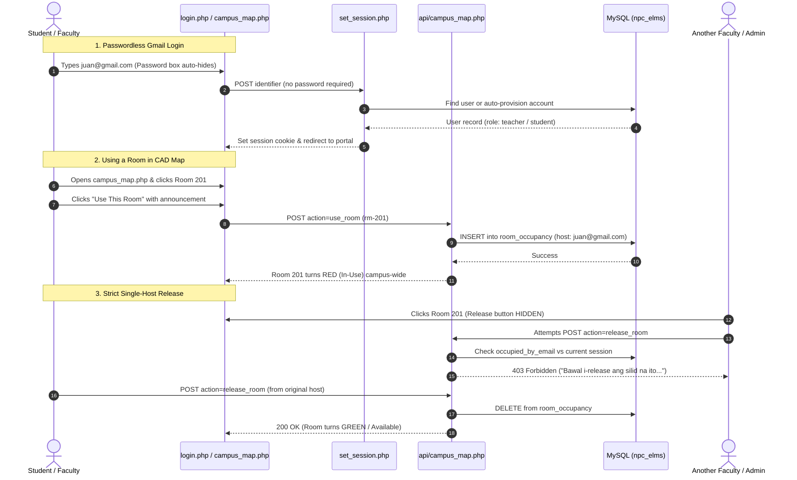

# 🏛️ NPC ELMS — Comprehensive System Architecture & File Directory Guide

> **Project:** Navotas Polytechnic College — Electronic Learning Management System (NPC ELMS)  
> **Brand Theme:** Official NPC Forest Green (`#006837`) & Gold (`#f59e0b`), aligned with [navotaspolytechniccollege.edu.ph](https://navotaspolytechniccollege.edu.ph/)  
> **Language:** Taglish (Technical English with conversational Tagalog context)  
> **Target Audience:** Developers, IT Admins, and College Staff

---

## 📑 Table of Contents
1. [Executive Overview & Architecture](#1-executive-overview--architecture)
2. [Deep Dive: The `supabase_helper.php` Bridge Engine](#2-deep-dive-the-supabase_helperphp-bridge-engine)
3. [Root Entry Files (`/`)](#3-root-entry-files-)
4. [Admin Portal (`/admin`)](#4-admin-portal-admin)
5. [Faculty / Teacher Portal (`/teacher`)](#5-faculty--teacher-portal-teacher)
6. [Student Portal (`/student`)](#6-student-portal-student)
7. [API Backend Endpoints (`/api`)](#7-api-backend-endpoints-api)
8. [Core Modules & Shared Helpers (`/includes`)](#8-core-modules--shared-helpers-includes)
9. [Assets, Design Tokens & CAD Engines (`/assets`)](#9-assets-design-tokens--cad-engines-assets)
10. [Database Architecture & Migrations (`/migrations`, `/database`)](#10-database-architecture--migrations-migrations-database)
11. [Local AI Backend (`/backend`)](#11-local-ai-backend-backend)
12. [Virtual Classrooms via WebRTC (`/plugnmeet`)](#12-virtual-classrooms-via-webrtc-plugnmeet)
13. [End-to-End System Data Flow](#13-end-to-end-system-data-flow)

---

## 1. Executive Overview & Architecture

Ang **NPC ELMS** is an integrated academic and institutional management platform built specifically for Navotas Polytechnic College. It combines multiple systems into a single unified web application:

1. **Learning Management System (LMS):** Course modules, lecture slides, assignments, and submissions.
2. **Academic Records & Gradebook Studio:** CHED-aligned computational grade encoding (Prelim, Midterm, Finals) with real-time recalculations.
3. **Live RFID & QR Attendance:** Fast barcode/QR scanning at campus gates and inside lecture rooms.
4. **Interactive DPWH CAD Blueprint & 3D BIM Map:** High-performance 2D vector CAD canvas engine and 3D digital twin featuring real-time room occupancy, live student headcount, and strict single-host room ownership.
5. **PlugNmeet WebRTC Virtual Classrooms:** Built-in video conferencing, breakout rooms, screen sharing, and interactive whiteboards for hybrid classes.
6. **Local AI Document Assistant:** An offline Llama-powered AI assistant trained on official NPC student handbooks and policy documents.

### 🛠️ Core Tech Stack
- **Backend:** PHP 8.2+ running on local Apache/XAMPP.
- **Database:** MySQL / MariaDB (InnoDB engine with relational foreign keys and audit logging).
- **Frontend:** Vanilla JavaScript (ES6+), HTML5, TailwindCSS (configured with Material Design 3 semantic color variables), and Google Material Symbols.
- **2D & 3D Visuals:** HTML5 Canvas 2D Vector Engine, Three.js (r128), OrbitControls.
- **Authentication:** Unified secure institutional authentication:
  - Official Institutional NPC Google Workspace Login (`@navotaspolytechniccollege.edu.ph`).
  - Direct Credentials Login (Official NPC Email or Student Number + Password verification against MySQL).
  - Quick Role Access (Student, Faculty, Admin) for instant 1-click dev testing on localhost.

---

## 2. Direct MySQL Architecture & Secure Institutional Login Flow

Lahat ng data transactions sa system ay **100% direct sa local MySQL database (`npc_elms`)** na tumatakbo sa XAMPP. Walang external cloud dependencies para sa core academic features.

### 🗄️ 1. Paano Kumokonekta ang System sa MySQL (`includes/db.php`)
Lahat ng PHP files at APIs ay tumatawag sa singleton function na `getDB()`:
```php
function getDB(): PDO {
    $host = '127.0.0.1';
    $db   = 'npc_elms';
    $user = 'root';
    $pass = '';
    $dsn  = "mysql:host=$host;dbname=$db;charset=utf8mb4";
    return new PDO($dsn, $user, $pass, [
        PDO::ATTR_ERRMODE            => PDO::ERRMODE_EXCEPTION,
        PDO::ATTR_DEFAULT_FETCH_MODE => PDO::FETCH_ASSOC,
        PDO::ATTR_EMULATE_PREPARES   => false,
    ]);
}
```
- **Performance:** Direct localhost socket connection via port 3306.
- **Security:** Gumagamit ng prepared statements (`$stmt->prepare()`) na 100% protektado laban sa SQL injection.

---

### 🛡️ 2. Secure Institutional Login & Real-Time Verification Flow
Ito ang eksaktong proseso kung paano protektado ang login system sa MySQL:

1. **Credentials Input (`login.php`):**
   - Tumatanggap ng **Official NPC Email** (hal. `student2024001@navotaspolytechniccollege.edu.ph`) o **Student Number** (hal. `2024-00192`).
   - Ang password field ay **palaging visible at required** para sa lahat ng users. Tinanggal ang vulnerable passwordless bypass modal.
   - Default master development password para sa lahat ng NPC accounts: `npc12345` (naka-hash via bcrypt sa database).

2. **Direct MySQL Password & Identity Verification (`login.php`):**
   - Pagka-submit ng form, agad tumatakbo ang verification query sa MySQL:
     ```sql
     SELECT u.* FROM users u 
     LEFT JOIN students s ON (s.email = u.email OR s.user_id = u.id) 
     WHERE LOWER(u.email) = ? 
        OR LOWER(u.student_number) = ? 
        OR LOWER(s.student_number) = ? 
     LIMIT 1;
     ```
   - Sinusuri ang password gamit ang `password_verify($password, $u['password_hash'])`.
   - Kung mali ang password, magbabalik ng clear alert: *"Invalid password. Please check your credentials (Default: npc12345)."*
   - Kung hindi NPC email ang ginamit, ipinapaalala ng system: *"Only official NPC accounts (@navotaspolytechniccollege.edu.ph) or registered student numbers are permitted."*

3. **Secure Session Creation:**
   - Kapag valid ang password at account, ise-set ang `$_SESSION['user_id']`, `$_SESSION['email']`, at `$_SESSION['role']`.
   - Diretsong i-di-redirect ang user sa tamang portal:
     - Student ➔ `/student/index.php`
     - Faculty ➔ `/teacher/index.php`
     - Admin ➔ `/admin/index.php`

4. **1-Click Quick Role Access:**
   - Sa ilalim ng login card, ibinalik ang **Quick Role Access** buttons (`dev_login.php?role=student`, `role=teacher`, `role=admin`) para sa mabilisang role testing sa localhost nang hindi kailangang mag-type nang paulit-ulit.

---

### 📊 3. Mga Pangunahing Tables sa MySQL Database (`npc_elms`)
- **`users`**: Naglalaman ng account id, email (Gmail o NPC email), full name, role, at active status.
- **`students`**: Student number, degree program (hal. BSCS, AIS), year level, at section.
- **`teachers`**: Faculty profile, department, at instructor credentials.
- **`classes`**: Masterlist ng mga subjects, sections, schedule, at assigned professors.
- **`grades` & `grade_items`**: Compute-ready grades (quizzes, prelims, midterms, finals) na ini-encode ng teachers.
- **`attendance`**: RFID at QR swipe logs na may exact timestamps.
- **`room_occupancy`**: Real-time room status sa CAD blueprint (in-use status, host email, activity announcement).
- **`security_audit_logs`**: System security events at audit trail.

---

## 3. Root Entry Files (`/`)

The files located in the root directory serve as user-facing entry points, authentication handlers, and core application dispatchers:

### 🚪 `login.php`
- **Purpose:** Primary institutional sign-in page.
- **Key Features:**
  - **Official NPC Seal Asset (`/assets/img/npc-logo.png`):** Displays the official college seal on both the desktop brand story and mobile card.
  - **NPC Forest Green Aurora Gradient:** Clean glassmorphism aesthetic (`#012415` to `#006837`) matching [navotaspolytechniccollege.edu.ph](https://navotaspolytechniccollege.edu.ph/).
  - **Passwordless Gmail Auto-Login UX:** As soon as a user types an email containing `@gmail.com` (or any `@` email) into `#identifier`:
    1. JavaScript immediately hides the `#password-group` input.
    2. Shows a badge: *"⚡ Gmail Auto-Login Active: Hindi na hihingin ang password. Direct auto-login agad!"*
    3. Changes the button text to *"⚡ Instant Auto-Login (Walang Password)"*.
  - **Backend Auto-Provisioning:** If an email is not yet registered in MySQL, it automatically creates a new account record with the proper role (`student`, `teacher`, or `admin`), generates session cookies, and redirects the user immediately.
  - **1-Click Test Account Chooser Modal:** Quick access to pre-configured student, faculty, and admin Gmail profiles for testing.

### 🌐 `index.php`
- **Purpose:** Root URL smart router (`http://127.0.0.1:8000/`).
- **How it works:** Checks `isLoggedIn()`.
  - If **unauthenticated**: Redirects to `/login.php`.
  - If **authenticated**: Dispatches to the user's dashboard based on their role:
    - Admin / Registrar ➔ `/admin/index.php`
    - Faculty / Teacher ➔ `/teacher/index.php`
    - Student ➔ `/student/index.php`

### 🗺️ `campus_map.php`
- **Purpose:** Fullscreen interactive **DPWH CAD Blueprint and 3D Campus BIM Workstation**.
- **Key Features:**
  - **DPWH Floorplans:** Covers **2F (Academic & Labs)**, **3F (Library & Sciences)**, **4F (Gymnasium Arena)**, and **RD (Roof Deck)**.
  - **2D Vector Canvas Engine (`npc-campus-cad.js`):** Smooth infinite pan, multi-touch zoom, live tape measure tool, column grid bubbles (A–J, 1–9), and architectural layer toggles.
  - **Real-Time Room Occupancy Polling:** Automatically queries `/api/campus_map.php?action=get_occupancy` every 3.5 seconds (< 5ms response time). Occupied rooms immediately highlight in red.
  - **Strict Single-Host Room Release Enforcement:**
    - Only the specific professor or administrator who clicked *"Use This Room"* can release that room.
    - If another faculty member or admin inspects an occupied room, the Release button is hidden, and an informative note is displayed:  
      `🔒 Silid ay in-use ni <Professor Name>. Siya lamang ang may pahintulot mag-release nito.`
    - Backend rejects any unauthorized release attempts with a **403 Forbidden** status code.
  - **Inspector Drawer:** Displays room specifications, live RFID student attendance headcount bar, ongoing activity notice, and hybrid virtual room link.

### 🔑 `set_session.php`
- **Purpose:** Server-side session provisioner for OAuth and direct logins.
- **Features:** Validates email domains (`@navotaspolytechniccollege.edu.ph`, `@gmail.com`, and `@googlemail.com`), provisions users in MySQL, sets session variables (`$_SESSION['user_id']`, `$_SESSION['role']`, `$_SESSION['email']`), and initializes CSRF security tokens.

### 🔄 `auth_callback.php`
- **Purpose:** Client-side OAuth token listener. Captures hash fragments (`#access_token=...` or `#id_token=...`) from Google or Supabase and forwards them to `set_session.php` via AJAX.

### 🚪 `logout.php`
- **Purpose:** Secure logout handler. Logs a `LOGOUT_SUCCESS` security audit event, clears session cookies (`PHPSESSID`), destroys the server session, and redirects to `login.php`.

### ⚡ `dev_login.php`
- **Purpose:** Developer helper for 1-click role testing (e.g. `dev_login.php?role=teacher` logs in as faculty without entering credentials).

### 🔀 `switch_portal.php`
- **Purpose:** Multi-role switcher for Faculty and Admins to inspect the portal views of other roles (e.g., student perspective) without logging out.

### 📹 `live_room.php` & `live_room_plugnmeet.php`
- **Purpose:** Hybrid virtual classroom integration connecting to the PlugNmeet WebRTC server for real-time video, audio, screen share, and interactive whiteboard.

### ⚙️ Startup & Utility Scripts:
- **`start.bat`**: One-click script to start the local PHP server (`127.0.0.1:8000`) and verify MySQL service status.
- **`stop.bat`**: Batch script to terminate background PHP development servers.
- **`tunnel.js`**: Node.js script for mobile remote access via Cloudflare or Localtunnel.
- **`.env`**: Centralized environment secrets (DB host, username, password, Supabase credentials, session keys).
- **`.htaccess`**: Apache configuration for HTTP security headers and URL rewrites.

---

## 4. Admin Portal (`/admin`)

The Administrative workspace handles college-wide governance, student records, scheduling, user roles, and security audit logs. Protected by `requireRole('admin')`.

### 📊 `admin/index.php`
- **Purpose:** Executive Overview Dashboard.
- **Displays:** Total active students, instructors, active classes, storage health, and quick administration links.

### 📚 Subfolder: `admin/academic/`
1. **`classes.php`**: Masterlist of all official college classes and sections (e.g., AIS 2A, BSCS 3B).
2. **`class_view.php`**: In-depth inspection of a selected class — roster of enrolled students, syllabus, and attendance percentages.
3. **`attendance.php`**: College-wide attendance monitoring across all buildings and floors.
4. **`grades.php`**: Master Gradebook Console where the Registrar monitors grade submissions from professors across departments.
5. **`schedules.php`**: Room and timetable management to prevent room booking collisions.
6. **`students.php`**: Comprehensive student directory containing student IDs, programs, year levels, and enrollment statuses.
7. **`elms.php`**: Content repository for campus-wide digital learning modules.

### 📢 Subfolder: `admin/communication/`
1. **`announcements.php`**: Campus broadcast publisher for bulletins that appear on student and faculty feeds.
2. **`docs.php`**: Official institutional handbook and guidelines repository.
3. **`ai_assistant.php`**: Admin console to query institutional documents via local AI.

### 📥 Subfolder: `admin/importers/`
1. **`import_students.php`**: Bulk CSV/Excel uploader for enrolling cohorts each semester.
2. **`import_teachers.php`**: Batch importer for faculty profiles and department assignments.
3. **`import_schedules.php`**: Master schedule spreadsheet importer.
4. **`parse_schedule_text.py` & `parse_students_file.py`**: Python helper scripts that clean and normalize raw spreadsheets before database insertion.

### 🛡️ Subfolder: `admin/security/`
1. **`audit.php`**: Real-time security telemetry viewer displaying user logins, 403 Forbidden attempts, room claim events, and IP addresses.
2. **`users.php`**: Account management tool to activate, deactivate, reset passwords, or promote accounts to faculty/admin roles.

### 📈 Subfolder: `admin/system/`
1. **`reports.php`**: CHED regulatory reporting tools and academic analytics.
2. **`settings.php`**: Global academic calendar cutoff dates and semester settings.

---

## 5. Faculty / Teacher Portal (`/teacher`)

Designed to streamline instructor workflows, grade encoding, RFID attendance scanning, and lesson preparation. Protected by `requireRole('teacher')`.

### 👨‍🏫 `teacher/index.php`
- **Purpose:** Faculty Command Center displaying daily teaching schedule, quick link to assigned rooms on the CAD map, and official notices.

### 📝 `teacher/grades.php`
- **Purpose:** Excel-style Interactive Grade Encoding Studio.
- **Features:** Auto-computes Class Standing, Quizzes, Attendance, Midterm Exam, and Final Grade according to NPC academic guidelines. Includes real-time auto-saving via AJAX to `/api/gradebook.php`.

### 📋 `teacher/attendance.php`
- **Purpose:** Live RFID and Barcode Student Attendance Scanner.
- **Workflow:** When students scan their IDs, their photo, name, and timestamp (Present or Late) instantly appear on screen. Also includes an excuse slip review module.

### 🏫 `teacher/classes.php`
- **Purpose:** Class directory for managing student rosters and academic standing.

### 📖 `teacher/courses.php`
- **Purpose:** Learning Material Manager for uploading syllabus PDFs, lecture slides, and assignment prompts.

### 🤖 `teacher/ai_assistant.php` & `teacher/ai_tools.php`
- **Purpose:** AI Co-Pilot for generating multiple-choice quizzes, grading rubrics, and lesson plans from lesson topics.

---

## 6. Student Portal (`/student`)

The personal hub for Navotas Polytechnic College students to view their schedule, academic transcript, digital ID, and learning modules.

### 🎓 `student/index.php`
- **Purpose:** Student homepage showing personal details (`2024-00192 · AIS 2A`), daily classes with direct CAD map pins, and campus announcements.

### 📜 `student/academic.php`
- **Purpose:** Official Grade Viewer and Academic Transcript displaying subject grades, units, and General Weighted Average (GWA).

### 📚 `student/courses.php`
- **Purpose:** Digital Courseware Hub for downloading lecture files and submitting assignments.

### 🕒 `student/schedule.php`
- **Purpose:** Weekly Class Timetable with *"Locate on CAD Map"* buttons that zoom directly into the room on `campus_map.php`.

### 🪪 `student/qrcode.php`
- **Purpose:** Dynamic Digital Student ID with cryptographically signed QR codes for gate access and attendance scanning.

### 🤖 `student/ai_assistant.php`
- **Purpose:** 24/7 AI Academic Tutor answering questions about coursework and student handbooks.

### ⚙️ `student/settings.php`
- **Purpose:** User profile settings, Dark/Light mode theme toggle, and notification preferences.

---

## 7. API Backend Endpoints (`/api`)

Lightweight, high-performance REST endpoints connecting frontend JavaScript to the database:

### 📍 `api/campus_map.php`
- **The Core Workstation API:**
  - `action=get_floors_data`: Returns vector CAD geometries (walls, doors, grid lines) for 2F, 3F, 4F, and RD.
  - `action=get_occupancy`: High-speed polling endpoint (< 5ms response time) returning active room occupancies and announcements.
  - `action=use_room` (POST): Claims an available room for faculty/admin.
  - `action=release_room` (POST): **Strictly enforces single-host release**. Checks that `occupied_by_email === userEmail`. If another user attempts to release, returns **403 Forbidden**.
  - `action=update_announcement` (POST): Updates room notice text.

### 📊 `api/gradebook.php`
- Saves teacher grade submissions, recalculates weighted formulas, and updates the `grades` table.

### 👤 `api/student.php` & `api/faculty.php`
- Asynchronously serves student/faculty profiles, subject rosters, and timetable data.

### 🔔 `api/notifications.php`
- Delivers real-time unread notification badge counts.

### 👥 `api/realtime.php`
- Tracks online presence and active user counts.

### 🤖 `api/ask.php`
- Semantic search endpoint querying institutional documents via local AI.

### 📁 `api/upload_document.php`, `api/delete_document.php`, & `api/download_material.php`
- Manages secure document uploads, deletions, and role-gated file downloads.

### 🩺 `api/health.php`
- Diagnostic probe checking MySQL connection and server availability.

---

## 8. Core Modules & Shared Helpers (`/includes`)

The architectural backbone containing security, database abstractions, and reusable UI components:

### 🔒 `includes/auth.php`
- **Security Kernel:** Provides `isLoggedIn()`, `requireRole()`, CSRF token generation/verification, and security audit event logging (`logSecurityEvent()`).

### 🗄️ `includes/db.php`
- **Database Connection Singleton:** Establishes a hardened PDO MySQL connection with UTF-8 encoding and prepared statements to prevent SQL Injection.

### ☁️ `includes/supabase_helper.php`
- **Legacy Compatibility Layer:** Kept for internal backward compatibility with older endpoints, but all queries directly resolve locally to MySQL.

### 🧭 `includes/_sidebar.php`
- **Unified Navigation Sidebar:**
  - Renders the official **NPC Seal (`/assets/img/npc-logo.png`)**.
  - Applies the official deep green background (`#012415`) with gold glow accents.
  - Automatically switches menu items based on the active role (`student`, `faculty`, `admin`).
  - Fully responsive with mobile drawer support.

### 🎨 `includes/_head.php` & `includes/_denied_banner.php`
- **`_head.php`**: Centralized HTML head tags, Google Fonts, and theme bootstrap.
- **`_denied_banner.php`**: Reusable banner alert for 403 Forbidden notices.

---

## 9. Assets, Design Tokens & CAD Engines (`/assets`)

Contains all visual styling, vectors, and graphics rendering engines:

### 🎨 `assets/css/styles.css`
- **Master Design System:**
  - Semantic CSS tokens: `--primary-rgb: 0 104 55` (NPC Forest Green), `--primary-container-rgb: 0 77 41`, `--secondary-rgb: 202 138 4` (NPC Gold), `--nav-bg-rgb: 1 36 21`.
  - Supports both Light and Dark themes, smooth micro-interactions, and blueprint layer styling.

### 🖼️ `assets/img/npc-logo.png` & `assets/images/npc-logo.png`
- The user-provided official seal of Navotas Polytechnic College (green border, torch of wisdom, laurel wreath, "1994").

### 📐 `assets/js/npc-campus-cad.js`
- **2D Vector CAD Canvas Engine:**
  - Built on pure HTML5 Canvas for 60+ FPS performance.
  - Features spatial hit detection, live room occupancy color changes (green ➔ red), and interactive distance measuring.

### 🏢 `assets/js/npc-campus-3d.js` & `assets/js/npc-blender-3d.js`
- Procedural Three.js BIM engine that builds interactive 3D digital twins of the college floors.

### 🗺️ `assets/js/npc-floorplans-data.js`
- The coordinate database containing exact millimeter dimensions, walls, columns, doors, and column grids (Grids A–J, 1–9) for Floors 2F, 3F, 4F, and RD.

---

## 10. Database Architecture & Migrations (`/migrations`, `/database`)

Relational schema management in MySQL:

### 📜 `migrations/npc_elms_mysql.sql`
- **Master Schema:**
  - `users`: Core account identity, roles (`student`, `teacher`, `admin`), password hashes.
  - `students` & `teachers`: Extended profile details, student numbers, departments.
  - `classes` & `enrollments`: Course schedules, instructors, and enrolled rosters.
  - `grades` & `grade_items`: Formulaic breakdown of student academic performance.
  - `attendance`: RFID/QR swipe timestamps and excuse requests.
  - `room_occupancy`: Real-time state of campus rooms (host email, activity, announcement).
  - `security_audit_logs`: Detailed audit trail of sensitive system actions.

---

## 11. Local AI Backend (`/backend`)

Provides offline AI intelligence:
- **`backend/main.py` & `query_ai.py`**: Python FastAPI services for semantic document indexing.
- **`backend/elms_courses.json` & `elms_presence.json`**: High-speed memory caches for presence and active sessions.

---

## 12. Virtual Classrooms via WebRTC (`/plugnmeet`)

An open-source WebRTC video conferencing client directly embedded within NPC ELMS, allowing remote lecture broadcasts, screen sharing, and recording without third-party subscriptions.

---

## 13. End-to-End System Data Flow



---

## 🏁 Summary
This document gives you a complete, file-by-file breakdown of the entire **NPC ELMS** ecosystem. Whether you are debugging, extending features, or presenting the system to institutional evaluators, you now have the exact architectural blueprint of the application! 🚀
