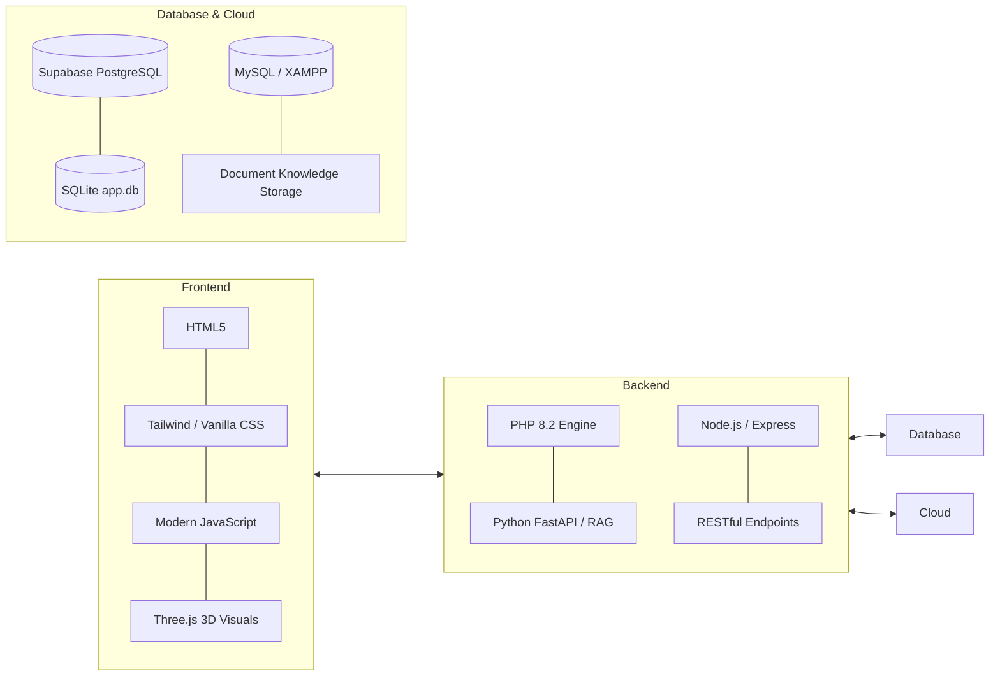
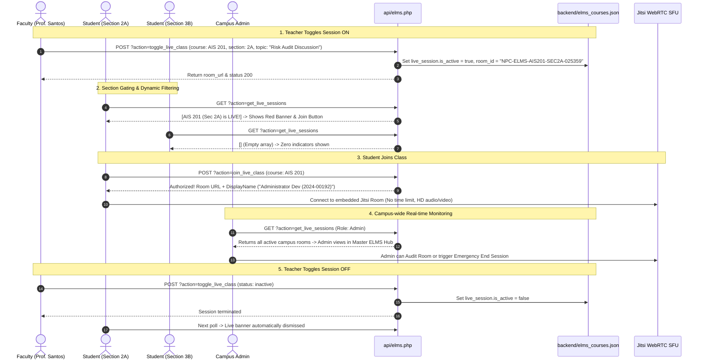

# 🧠 Second Brain Master Profile: Jilo A. Derramas

> [!abstract] Overview
> Central knowledge base entry and personal developer profile for **Jilo A. Derramas**, student at **Navotas Polytechnic College (NPC)**. This file serves as the foundational anchor for Obsidian graph connections across ongoing projects, academic subjects, AI research, and programming experiments.

> [!tip] 🧠 Modular Obsidian Brain Architecture
> The NPC ELMS knowledge vault has been modularized into interconnected topic nodes for Obsidian Graph View:
> - **Central Map of Content**: [[NPC_ELMS_Brain_Index]]
> - **Visual Interactive Canvas**: [[Untitled.canvas]]
> - **Virtual Classroom Subsystem**: [[Virtual_Classroom_WebRTC]] · [[Section_Gated_Access_Control]] · [[Teacher_Session_Controller]] · [[Admin_Live_Audit_Center]]
> - **Portals & Academic Flow**: [[Student_Portal_Architecture]] · [[Faculty_Portal_Architecture]] · [[Admin_Master_Hub]] · [[Coursework_and_Grading_Engine]]
> - **3D Graphics & Design**: [[ThreeJS_3D_Graphics_Engine]] · [[UI_Design_System_and_Tailwind]] · [[Academic_Calendar_and_Events]]
> - **Security & Network**: [[Authentication_and_Session_State]] · [[Security_and_Audit_Logging]] · [[Database_and_Storage_Architecture]] · [[Mobile_and_Remote_Tunneling]]

---

## 👤 About Me & Identity

- **Full Name**: Jilo A. Derramas
- **Role**: Student, Builder, Aspiring Software Engineer & AI Systems Developer
- **Institution**: [[Navotas Polytechnic College]] (NPC)
- **Primary Focus Areas**:
  - **Artificial Intelligence** (Local LLMs, RAG, AI Agents, Knowledge Bases)
  - **Full-Stack Web Development** (PHP, JavaScript, Tailwind CSS, Three.js, Node.js)
  - **Backend & Databases** (Supabase, MySQL, SQLite, REST APIs, Auth Systems)
  - **Automation & Tool Integration** (Obsidian, MCP, Custom Scripts, Git)
  - **Game Development & Systems Design** (Roblox, RPG mechanics, Game loops)

---

## 🎓 School & Academic Learning

I am currently studying at **Navotas Polytechnic College (NPC)**.

### Core Subjects & Technical Topics
* [[Information Systems]]
* [[Enterprise Architecture]] (EA)
* [[Human-Computer Interaction]] (HCI)
* [[Management Information Systems]] (MIS)
* [[Quantitative Methods]] (QUAMETH)
* [[Accounting Information Systems]] (AIS)
* [[Computer Programming]] & Web Development
* Technology-related Research & Systems Documentation

### Frequent School Deliverables
* PowerPoint & Canva presentations
* Reviewers, essays, and study guides
* Concept maps, architectural diagrams, and flowcharts
* Group research papers, video scripts, and lab activities

> [!tip] Learning Preference
> I learn fastest when complex technical topics are explained using **simple, intuitive Taglish** with real-world analogies, step-by-step breakdowns, and direct code examples:
> $$\text{Simple Concept} \longrightarrow \text{Concrete Example} \longrightarrow \text{Step-by-Step Build} \longrightarrow \text{Actual Application}$$

---

## 💻 Technical Skills & Stack



### Frontend
- **Languages/Markup**: HTML5, Semantic CSS, JavaScript (ES6+)
- **Styling**: Tailwind CSS, Vanilla CSS custom design systems, Glassmorphism, Dark mode
- **Visuals & 3D**: Three.js (`three.min.js`, `npc-three.js`), Canvas 2D/3D visualizers, Dynamic HUD scanner

### Backend & Server
- **PHP**: PHP 8.2, session management, CSRF protection, role-based access gates
- **Python**: Python 3.10+, FastAPI, PyPDF, python-docx, openpyxl, TF-IDF cosine similarity
- **Node.js**: Scripting, local tunneling (`tunnel.js`), build tooling

### Databases & Cloud
- **Supabase**: PostgreSQL, Row Level Security (RLS), Supabase Auth / Google OAuth, Service Role queries
- **Relational Databases**: SQLite (`app.db`), MySQL, MSSQL
- **Local Storage**: System temporary directories, secure document indexing

### Tools & DevOps
- **Editors & IDEs**: VS Code, Antigravity IDE, Obsidian
- **Version Control**: Git, GitHub
- **Environment**: Windows 11, PowerShell, XAMPP, LocalAI llama runtime, ngrok

---

## 🚀 Active Projects

### 🏛️ 1. [[NPC Connect]] (Campus Academic & AI Portal)
A comprehensive web portal designed specifically for **Navotas Polytechnic College**, featuring role-based dashboards, dynamic QR attendance, grade management, and localized AI assistance.

#### Modular Architecture
* 📁 `student/`: Student Dashboard, Academic Records, Schedules & COR, Dynamic QR Scanner, Campus AI Assistant, Settings.
* 📁 `teacher/`: Faculty Dashboard, Class Rosters, Grade Encoding & Approval Submission, Attendance Scanner, Teaching AI Assistant.
* 📁 `admin/`:
  * `academic/`: Classes, Class Views, Schedules, Grade Approvals, Student Directory, Attendance Records.
  * `security/`: User Account Management, Audit Logs.
  * `communication/`: Official Announcements, Documents Studio, Knowledge Indexer.
  * `system/`: Global Settings, Analytics & System Reports.
  * `importers/`: CSV/Excel parsers for students, teachers, and timetable schedules.
* 📁 `api/`: Hardened JSON REST endpoints (`admin.php`, `faculty.php`, `student.php`, `gradebook.php`, `ask.php`, `health.php`).
* 📁 `backend/`: Python AI Engine (`query_ai.py`), FastAPI backend (`main.py`), SQLite helpers (`database.py`).
* 📁 `includes/`: Core authentication (`auth.php`), Supabase client (`supabase_helper.php`), unified UI components (`_head.php`, `_sidebar.php`).
* 📁 `assets/`: Centralized styles (`assets/css/styles.css`) and scripts (`npc.js`, `npc-three.js`, `three.min.js`).

---

### 🤖 2. [[Local AI & RAG Engine]] (Campus Knowledge Chatbot)
- **Concept**: An AI chatbot grounded on official NPC documents (memos, student handbook, grading policies, curriculum).
- **Retrieval Pipeline**: Multi-format extraction (PDF, DOCX, XLSX, TXT) $\rightarrow$ local keyword & semantic matching $\rightarrow$ dynamic prompt augmentation $\rightarrow$ response generation.
- **Privacy & Safety**: Role-gated data tools (`ai_tools.php`) ensuring students only retrieve their own records while admins access aggregate summaries.

---

### 📲 3. [[Dynamic QR & Attendance Verification System]]
- **Concept**: Rotating dynamic QR codes generated in classrooms to prevent attendance fraud and proxy check-ins.
- **Rules**:
  - Scan within first 5 minutes: Marked **Present**
  - Scan after 5 minutes: Marked **Late**
  - Unscanned: Marked **Absent** (with excuse slip upload workflow)

---

## 🧠 Personal Knowledge Management (Second Brain Vision)

The goal is to connect all facets of learning into an interconnected graph:

```
[Academic Subjects]  <--->  [NPC Connect Project]  <--->  [AI & Local LLMs]
        ^                                                       ^
        |                                                       |
        v                                                       v
 [Obsidian Vault]     <--->     [Personal Notes]     <--->  [Game Dev Ideas]
```

### Desired Automation & AI Integration
- **Bi-directional Knowledge Linking**: Automatically linking daily notes, project logs, and reference materials.
- **Agentic Assistance**: Using AI as an active partner that remembers past project constraints, suggests improvements, and flags architectural errors.
- **Local-First Privacy**: Storing notes in Markdown locally while querying them through AI agents.

---

## 🎮 Gaming & Systems Architecture Interests

### Favorite Games
- **Call of Duty: Mobile (CODM)**: Competitive FPS, gyroscope tuning, low-latency sensitivity, frame stability.
- **Roblox**: Systems design, Lua scripting, custom mechanics.
- **Mobile Legends: Bang Bang (MLBB)**: Strategy, hero mechanics, meta analysis.

### Game Mechanics Exploration
- **Inventory & Item Systems**: Stacking, rarity tiers, capacity limits.
- **Progression Loops**: Leveling, skill trees, rebirth/evolution multipliers.
- **Encounter Design**: Boss AI state machines, procedural dungeon generation, NPC dialogue trees.
- **Performance Optimization**: Managing FPS drops, mobile thermal throttling, device coolers.

---

## 📱 Hardware & Device Troubleshooting

- **Mobile Tech**: Android performance tuning, iPhone battery/charging characteristics, fast chargers, OTG, gyroscope calibration.
- **PC Hardware**: CPU/GPU utilization, thermal management, background process optimization.
- **Storage & Backup**: Cloud syncing (Google Drive, iCloud) alongside local offline backups.

---

## 🤖 AI Collaboration Rules (How to Assist Jilo)

> [!important] Guidelines for AI Assistant
> 1. **Keep it simple and direct**: Don't use unnecessarily academic or robotic jargon.
> 2. **Taglish friendly**: Speak naturally in Taglish whenever it clarifies the explanation.
> 3. **Step-by-step reasoning**: Walk through the *why* and *how*, not just the raw code.
> 4. **No blindly agreeing**: If an architectural approach has bugs, security flaws, or high complexity, call it out honestly and offer a better solution.
> 5. **Remember project context**: Keep in mind the structure of [[NPC Connect]], Supabase auth, and local SQLite/PHP conventions.
> 6. **Action-oriented**: Deliver working, tested code that respects the file organization.

---

## 🛠️ NPC Connect Devlog: Notification System & Topbar Tooltip Fix (2026-09-09)

### 1. Root Cause Analysis
- **Tooltip Viewport Clipping**: The global `[data-tip]:hover::after` was positioned with `bottom: calc(100% + 8px)`. Since `#topbar` is sticky at `top: 0` (with element center `y ≈ 31px`), placing the tooltip above the button placed it at `y = -25.6px`, pushing it off the top screen edge and making it invisible when hovered.
- **Subpage 404 on API**: `mountNotificationCenter()` called relative `fetch('api_notifications.php')` and `fetch('api_student.php?action=get_notifications')`. Pages inside subfolders (`/student/`, `/teacher/`, `/admin/academic/`) resolved this to nonexistent paths, breaking notification fetching.

### 2. Solutions Applied
- **Downward Tooltips for Topbars & Headers**: Added CSS rule `header [data-tip]:hover::after, #topbar [data-tip]:hover::after, [data-tip-pos="down"]:hover::after` using `top: calc(100% + 8px); bottom: auto;` and smooth `@keyframes tipInDown`.
- **Dropdown Tooltip Suppression**: Suppressed tooltips automatically when `#npc-notif-panel` is active (`.is-open` or `:has(#npc-notif-panel:not(.hidden))`) so tooltips don't collide with the open panel.
- **Absolute API Paths**: Updated fetch endpoints to `/api/notifications.php` and `/api/student.php?action=get_notifications` for universal subfolder support.
- **Viewport Boundary Clamping**: Ensured popover never clips on the left edge on mobile or narrower screens.
- **Fail-safe Fallback Mirroring**: Mirrored updates across `assets/css/styles.css`, `assets/js/npc.js`, root `styles.css`, and root `npc.js`.

---

## 🛡️ NPC Connect Devlog: AI Moderation, 3-Warning/5-Day Ban Policy, Schedule Bulk Import & Failing Students Audit (2026-09-09)

### 1. AI Safety & Moderation Architecture
- **Problem**: The AI Assistant lacked prompt guardrails and content moderation. Inappropriate, vulgar, or abusive queries (e.g. vulgar English & Tagalog slurs) were processed without consequences, without being flagged in the admin dashboard, and user chat history risked accidental wipe.
- **Engine Created (`includes/ai_moderation.php`)**:
  - **Multi-lingual Filter**: English and Filipino/Tagalog profanity, abusive terms, and leetspeak substitutions (`@` -> `a`, `1` -> `i`, `0` -> `o`, `3` -> `e`, etc.).
  - **3-Strike Warning Escalation**:
    - **Strike 1 / 3**: Academic policy warning explaining NPC Code of Conduct, remaining strikes (2), and consequence of suspension.
    - **Strike 2 / 3**: Final warning alert before lockout.
    - **Strike 3 / 3 (Account Lockout)**: Immediate **5-day suspension** (`banned_until = $now + (5 * 86400)`). Blocks all new prompt submissions until unban date.
  - **Zero Chat Wiping**: Conversations are strictly preserved in `localStorage` (`npc_student_ai_chat`, `npc_teacher_ai_chat`). Users can review previous academic assistance; chat is never automatically deleted.
  - **Audit Logging**: Every strike and ban event is logged to Supabase `security_logs` and persisted in `backend/ai_violations.json`.
- **Admin Dashboard Integration (`admin/index.php`)**:
  - Live **AI Safety & Policy Violations Tracker** displaying user accounts, warning levels, prompt snippet, lockout expiration, and an instant **Reset & Unban** button.

### 2. Section Schedule Bulk Import Bugfix
- **Problem**: When pasting raw schedule tables in `admin/academic/schedules.php`, `classes.php`, and `students.php`, the modal threw:
  `❌ Server communication error during schedule parsing.`
- **Root Causes**:
  1. Importer fetch URLs used relative paths `import_schedules.php` from subfolders, failing with 404.
  2. Missing `window.__CSRF__` token, causing 403 CSRF denials.
  3. `parse_schedule_text.py` relied on double-space splitting `\s{2,}` which broke when schedule lines had single spaces between subject title and days (e.g. `MANAGEMENT Saturday`).
- **Fix Applied**:
  - Rewrote `admin/importers/parse_schedule_text.py` with multi-tier parsing and smart regex time bisection (`TIME_RE = r'(\d{1,2}:\d{2}\s*(?:AM|PM)?\s*[-–—to]+\s*\d{1,2}:\d{2}\s*(?:AM|PM))'`).
  - Updated fetch calls to `/admin/importers/import_schedules.php` with `X-CSRF-Token` headers.

### 3. Portal Switcher Routing Bugfix
- **Problem**: Clicking "Student Portal" in the topbar portal switcher redirected back to Admin when browsing admin subpages.
- **Fix**: Replaced relative links `index.php`, `teacher.php`, `admin.php` with root-relative paths `/student/index.php`, `/teacher/index.php`, and `/admin/index.php` in `assets/js/npc.js` and `npc.js`.

### 4. Security Audit Log Row Deletion
- **Implementation (`admin/security/audit.php` & `api/admin.php`)**:
  - Added individual **Delete** button on each audit log row with confirmation and status spinner.
  - Added **Clear All Logs** button for mass maintenance.
  - Added backend endpoint `POST /api/admin.php?action=delete_audit_log` with CSRF validation and database synchronization.

### 5. Failing & At-Risk Students Audit
- **Implementation (`admin/academic/grades.php` & `api/admin.php`)**:
  - Added 3rd tab: **Failing & At-Risk Students** with live incident counter.
  - Added endpoint `GET /api/admin.php?action=get_failing_students` pulling failing grades (`grade > 3.00`, `grade = 5.00`, `Failed`, `INC`, `Dropped`) joined with student names, programs, and sections.
  - Added search filter, program filter, deficiency filter, and **Export Deficiencies CSV** feature.

---

## 🚀 NPC Connect Devlog: Student Dashboard Access & Portal Switcher Fix (2026-09-09)

### 1. Root Cause Analysis: Why Users Couldn't Reach Student Dashboard
- **Sidebar Grid Switcher**: In `includes/_sidebar.php` (line 120), the "Student" button pointed to `/index.php`.
- **Student Menu Dashboard Link**: In `includes/_sidebar.php` (line 49), the student menu's first item "Dashboard" pointed to `/index.php`.
- **Root `index.php` Session Redirect**:
  ```php
  $role = $_SESSION['role'] ?? 'student';
  if ($role === 'admin' || $role === 'registrar') {
      header('Location: /admin/index.php');
      exit;
  }
  ```
  Whenever an admin clicked "Student" or "Dashboard", the browser visited `/index.php`, which immediately redirected straight back to `/admin/index.php`.
- **Session Switching Gap**: There was no active portal toggle, meaning an admin session remained strictly `role === 'admin'`.

### 2. Solutions Implemented
1. **Created `/switch_portal.php`**:
   - Safe portal switching middleware for Admins, Registrars, and Faculty.
   - Stores original role in `$_SESSION['base_role']` so admins can switch to Student or Faculty view, and return to Admin view at any time.
   - Sets `$_SESSION['active_portal']` and adjusts `$_SESSION['role']`.
   - Injects demo student number `2024-00192` when switching to student view so student grade & schedule APIs load real records instead of returning empty or missing student number errors.
2. **Updated `includes/_sidebar.php`**:
   - Line 49: Changed Student menu Dashboard link from `/index.php` to `/student/index.php`.
   - Line 115: Changed `$npcUserRole` to check `$_SESSION['base_role'] ?? $_SESSION['role']` so the Portal Switcher buttons remain accessible even while previewing Student Portal.
   - Lines 120, 123, 127: Updated links to `/switch_portal.php?to=student`, `/switch_portal.php?to=teacher`, and `/switch_portal.php?to=admin`.
3. **Updated Root `index.php`**:
   - Uses `$_SESSION['active_portal'] ?? $_SESSION['role'] ?? 'student'` so visiting `/` respects the currently switched portal.
4. **Updated `assets/js/npc.js` and `npc.js`**:
   - Pointed topbar "View as..." dropdown links to `/switch_portal.php?to=student`, `/switch_portal.php?to=teacher`, and `/switch_portal.php?to=admin`.
   - Fixed Command Palette (Ctrl+K) "My Dashboard" shortcut from `index.php` to `/student/index.php`.
   - Read `meta.base_role || meta.role` so topbar switcher stays visible during portal preview.
5. **Updated `includes/auth.php`**:
   - Changed denial bounces in `require_admin()` and `require_teacher()` to route to `/student/index.php` instead of `/index.php`.
6. **Updated `api/student.php`**:
   - Added automatic fallback for demo student number (`2024-00192`) when accessed by administrators or faculty during preview.
7. **Updated `student/qrcode.php`**:
   - Changed redirect after QR scan from `index.php` to `/student/index.php`.

---

## 📅 NPC Connect Devlog: Live Date & Time Badges on Dashboards (2026-09-09)

### 1. Feature Description
- **Requirement**: Display the current date (`kung ano date ngayun`) exclusively on the three dashboard landing pages: **Student**, **Admin**, and **Faculty**.
- **Design Aesthetic**:
  - A modern pill badge row with an outline container.
  - Left chip: `calendar_today` icon + formatted long date (e.g. `Wednesday, September 9, 2026`).
  - Middle chip: `schedule` pulsing live clock (e.g. `5:43:04 PM`).
  - Right badge: Distinct role badge (`STUDENT`, `ADMIN PORTAL`, `FACULTY PORTAL`).

### 2. Files Updated
1. **[student/index.php](file:///c:/Users/Lovi/Downloads/llama-b10483-bin-win-cpu-x64/LocalAI/app/student/index.php)**:
   - Replaced old "Loading date..." placeholder with server-rendered `<?= date('l, F j, Y') ?>` and live ticker container `#current-date`.
2. **[admin/index.php](file:///c:/Users/Lovi/Downloads/llama-b10483-bin-win-cpu-x64/LocalAI/app/admin/index.php)**:
   - Added the date and time pill badge row right above the "Administrative Overview" title.
3. **[teacher/index.php](file:///c:/Users/Lovi/Downloads/llama-b10483-bin-win-cpu-x64/LocalAI/app/teacher/index.php)**:
   - Upgraded header greeting with the calendar chip and live ticking clock.
4. **[includes/auth.php](file:///c:/Users/Lovi/Downloads/llama-b10483-bin-win-cpu-x64/LocalAI/app/includes/auth.php)**:
   - Configured `date_default_timezone_set('Asia/Manila')` so all server date/time stamps strictly reflect Philippine Standard Time (PST, UTC+8).
5. **[assets/js/npc.js](file:///c:/Users/Lovi/Downloads/llama-b10483-bin-win-cpu-x64/LocalAI/app/assets/js/npc.js) & [npc.js](file:///c:/Users/Lovi/Downloads/llama-b10483-bin-win-cpu-x64/LocalAI/app/npc.js)**:
   - Implemented `mountLiveDateAndClock()` which synchronizes `#current-date` and `#npc-live-clock` in real-time every second without page reloads.

---

## 🗓️ NPC Connect Devlog: Interactive Academic Calendar Widget (2026-09-09)

### 1. Feature Architecture (`includes/_calendar.php`)
- **Core Component**: Created a reusable, rich, and responsive **Academic Calendar Widget** embedded across all three primary dashboards (**Student**, **Admin**, **Faculty**).
- **Interactive Capabilities**:
  - **Dynamic Month Navigation**: `<` and `>` month navigation with automatic calculation of day offsets, days in month, and previous-month pad days.
  - **"Today" Fast Jump**: One-click jump button returning to the current date.
  - **Today Highlight**: Active highlight with glowing ring styling on today's date.
  - **Event Dot Indicators**: Color-coded badges and dots:
    - 🟡 Amber: Examination periods (Prelims, Midterms, Semi-Finals, Finals)
    - 🔴 Red: Regular & special non-working campus holidays (All Saints' Day, Bonifacio Day, Christmas Recess)
    - 🟣 Purple: Grade encoding and registrar submission deadlines
    - 🟢 Green: Semester start and academic milestones
  - **Interactive Day Selection**: Clicking any day in the monthly grid updates the selected date title, highlights the cell, and filters specific academic events or lists upcoming milestones for that period.
  - **Contextual Actions**:
    - Student: Quick link to full schedule (`/student/schedule.php`) and Attendance QR (`/student/qrcode.php`).
    - Faculty: Quick link to teaching assignments (`/teacher/classes.php`) and Live Attendance QR (`/teacher/attendance.php`).
    - Admin: Quick link to Master schedule manager (`/admin/academic/schedules.php`) and Academic Settings (`/admin/system/settings.php`).

### 2. Placements
1. **[student/index.php](file:///c:/Users/Lovi/Downloads/llama-b10483-bin-win-cpu-x64/LocalAI/app/student/index.php)**: Embedded in the right column (`lg:col-span-1`) with `$CALENDAR_MODE = 'compact'`.
2. **[admin/index.php](file:///c:/Users/Lovi/Downloads/llama-b10483-bin-win-cpu-x64/LocalAI/app/admin/index.php)**: Embedded as a dedicated master academic calendar section with `$CALENDAR_MODE = 'full'`.
3. **[teacher/index.php](file:///c:/Users/Lovi/Downloads/llama-b10483-bin-win-cpu-x64/LocalAI/app/teacher/index.php)**: Embedded after Bento Stats with `$CALENDAR_MODE = 'full'`.

### 3. UI/UX Bugfix: Dual Mode Responsive Architecture (`compact` vs `full`)
- **Issue**: In the Student Dashboard's 1-column right sidebar (`lg:col-span-1`, ~340px width), Tailwind viewport breakpoint rules (`lg:grid-cols-12`) triggered desktop 2-column side-by-side mode. This squished the 7-day calendar into 55% width and the event details into 45% width, causing day number squishing, severe text clipping ("Wednes...", "TOD", "consultatio & attendan"), and overlapping footer action buttons.
- **Fix Implemented**:
  1. Introduced explicit **`compact` mode** in `includes/_calendar.php` specifically designed for narrow sidebar columns.
  2. **Dedicated Month Bar**: Full-width `< September 2026 >` navigation on its own line so controls never wrap or crowd.
  3. **Full-Width 7-Col Grid**: Day numbers take 100% of widget width with generous touch targets and crisp readability.
  4. **Vertical Event Strip**: Selected date info and event cards stack naturally below the calendar grid with zero horizontal truncation.
  5. **Clean Non-Overlapping Action Buttons**: "Full Schedule →" and "Scan QR" styled with proper flex spacing and dedicated touch targets.
  6. **Dual Mode Support**: Preserved expansive 2-column layout (`$CALENDAR_MODE = 'full'`) for Admin and Faculty dashboards where full horizontal width is available.
- **Verification**: Verified via Chrome subagent screenshot (`calendar_widget_full_1788947699221.png`). All text, badges, and buttons render cleanly with 0 clipping or overlap.

---

## 🎓 NPC ELMS Upgrade & Admin Academic Calendar Date Editor (2026-09-09)

### 1. Admin Calendar Date & Milestone Editor
- **Storage**: [`backend/academic_calendar.json`](file:///c:/Users/Lovi/Downloads/llama-b10483-bin-win-cpu-x64/LocalAI/app/backend/academic_calendar.json)
  - Pre-populated with official NPC AY 2026–2027 calendar dates (Examinations, Holidays, Submission Windows, Campus Events).
  - Automatically sorted chronologically upon save.
- **API Endpoint**: [`api/calendar.php`](file:///c:/Users/Lovi/Downloads/llama-b10483-bin-win-cpu-x64/LocalAI/app/api/calendar.php)
  - `GET ?action=get_events`: Public / student / faculty retrieval of all academic events.
  - `POST ?action=save_event`: Admin-only endpoint with CSRF verification (`X-CSRF-Token`) and security audit logging. Supports creating new dates or editing existing milestones.
  - `POST ?action=delete_event`: Admin-only endpoint with CSRF verification to delete dates.
- **Interactive UI ([includes/_calendar.php](file:///c:/Users/Lovi/Downloads/llama-b10483-bin-win-cpu-x64/LocalAI/app/includes/_calendar.php))**:
  - Automatically injects **"Edit Dates"** in top navigation and **"Edit / Add Milestone for this Date"** on selected date card for authenticated Administrators.
  - Interactive Modal: Date picker, Title input, Category dropdown (🟢 Academic Milestone, 🟡 Examination, 🔴 Campus Holiday, 🟣 Grade Deadline, 🔵 Campus Event), and Description notes.
  - Instant re-render: updates the in-memory dataset, places color-coded indicator dots on the grid, and updates event cards without requiring a page reload.
  - Synchronized across portals: Dates saved by Admin are immediately visible to Students and Faculty.

### 2. School ELMS (Electronic Learning Management System) Transformation
- **System Branding & Identity**:
  - Elevated platform identity to **NPC ELMS (Electronic Learning Management System)** for Navotas Polytechnic College.
  - Updated across [`login.php`](file:///c:/Users/Lovi/Downloads/llama-b10483-bin-win-cpu-x64/LocalAI/app/login.php), [`includes/_head.php`](file:///c:/Users/Lovi/Downloads/llama-b10483-bin-win-cpu-x64/LocalAI/app/includes/_head.php), and [`includes/_sidebar.php`](file:///c:/Users/Lovi/Downloads/llama-b10483-bin-win-cpu-x64/LocalAI/app/includes/_sidebar.php).
  - Sidebar reflects: `NPC ELMS`, `E-LEARNING SYSTEM · <PORTAL>`.
- **Dedicated Courses & ELMS Learning Hub ([student/courses.php](file:///c:/Users/Lovi/Downloads/llama-b10483-bin-win-cpu-x64/LocalAI/app/student/courses.php))**:
  - **Enrolled Subjects Breakdown**: AIS 201 (Accounting Information Systems), IS 204 (Enterprise Architecture), HCI 102 (Human-Computer Interaction), QUAMETH (Quantitative Methods).
  - **Syllabus & Lecture Modules**: Weekly modules, downloadable lecture PDFs, and slide decks.
  - **Assignments & Tasks Tracker**: Tracks pending, submitted, and graded coursework with total points and due dates.
  - **Coursework Submission Modal**: Allows students to submit online work (drive links or repository URLs) with instant feedback.
- **ELMS Backend API ([api/elms.php](file:///c:/Users/Lovi/Downloads/llama-b10483-bin-win-cpu-x64/LocalAI/app/api/elms.php))**:
  - `GET ?action=get_courses`: Serves enrolled subjects, module metadata, and assignment roster.
  - `POST ?action=submit_assignment`: Records student submissions into session storage.

### 3. Verification & Evidence
- **Admin Calendar Event Creation**: Tested adding "NPC Innovation & Tech Summit 2026" on September 25, 2026. Verified modal save and event card display (`admin_calendar_event_1788949167896.png`).
- **Student Synchronization**: Switched to student portal and verified September 25 shows the newly added milestone.
- **Courses & ELMS Page**: Verified `/student/courses.php` renders enrolled subjects, module downloads, and tasks (`courses_elms_hub_1788949219519.png`).

---

## 🌐 NPC Connect Devlog: Fully Interconnected ELMS Ecosystem (Faculty, Student, Admin) (2026-09-09)

### 1. Architectural Vision: Total Interconnectivity
- **User Directive**: *"sa faculty din and admin lahaaat kassi mag connect connect silaaa"* (Make all three roles—Faculty, Student, and Admin—fully interconnected in real-time across the entire ELMS).
- **Core Problem**: Previously, courses and assignments were static mockups on the student side without teacher authoring tools, student submission persistence, faculty grading capabilities, or administrative campus oversight.
- **Solution Engine**:
  ```mermaid
  sequenceDiagram
      autonumber
      actor Teacher as Faculty (Prof. Santos)
      actor Student as Student (Jilo / Lovi)
      actor Admin as Campus Admin
      participant API as api/elms.php
      participant DB as backend/elms_courses.json

      Note over Teacher, DB: 1. Faculty Publishes Material
      Teacher->>API: POST ?action=add_module (Lecture slides / PDFs)
      Teacher->>API: POST ?action=create_assignment (Tasks, points, due date)
      API->>DB: Persist course updates

      Note over Student, DB: 2. Student Consumes & Submits Work
      Student->>API: GET ?action=get_courses
      API-->>Student: Return updated modules & assignments
      Student->>API: POST ?action=submit_assignment (Link, notes)
      API->>DB: Record submission status "Submitted"

      Note over Teacher, DB: 3. Faculty Evaluates & Grades
      Teacher->>API: GET ?action=get_submissions
      Teacher->>API: POST ?action=grade_submission (Score 98/100, feedback remarks)
      API->>DB: Update submission status to "Graded"

      Note over Student, Admin: 4. Real-time Feedback & Oversight
      Student->>API: GET ?action=get_courses (Views score 98/100 + remarks)
      Admin->>API: GET ?action=get_submissions (Campus-wide compliance audit)
  ```

### 2. Persistent Central Data Layer (`backend/elms_courses.json`)
- Stores complete academic courses (`AIS 201`, `IS 204`, `HCI 102`, `QUAMETH 101`).
- Contains hierarchical sub-arrays for:
  - `modules`: `id`, `week`, `title`, `description`, `file_type`, `file_name`, `file_size`, `uploaded_at`.
  - `assignments`: `id`, `title`, `due_date`, `max_points`, `instructions`, `status`, `created_at`.
  - `submissions`: `id`, `assignment_id`, `student_id`, `student_name`, `student_number`, `course_code`, `submitted_link`, `notes`, `submitted_at`, `status`, `score`, `remarks`, `graded_by`, `graded_at`.

### 3. Universal Controller API (`api/elms.php`)
- **`get_courses`**: Returns all courses with modules, assignments, and individualized submission badges.
- **`add_module`**: Faculty/Admin endpoint to upload/publish lecture handouts and reading materials.
- **`create_assignment`**: Faculty/Admin endpoint to create homework, capstone problems, and quizzes.
- **`submit_assignment`**: Student endpoint to submit external links (GitHub/Google Drive) with comments.
- **`get_submissions`**: Returns submissions across courses, filtered by teacher assigned classes or unfiltered for Admins.
- **`grade_submission`**: Faculty/Admin endpoint to input numerical score (e.g. `98/100`), write personalized academic feedback, and finalize grade.
- **Security & Integrity**: Session auth check, role restrictions, and audit logging to Supabase `security_logs`.

### 4. Role-Specific User Interfaces
1. **Faculty ELMS Hub ([teacher/courses.php](file:///c:/Users/Lovi/Downloads/llama-b10483-bin-win-cpu-x64/LocalAI/app/teacher/courses.php))**:
   - Course cards showing section, units, schedule, and live counts.
   - **Upload Module Modal**: Add module number, title, notes, and file type (PDF/PPTX/ZIP).
   - **New Assignment Modal**: Specify title, deadline, max points, and rubric guidelines.
   - **Submissions Evaluation Table**: Shows student name, ID, submitted link, submission time, and grading action button.
   - **Grading & Feedback Modal**: Input score, type qualitative remarks, and save grade instantly.
2. **Student ELMS Hub ([student/courses.php](file:///c:/Users/Lovi/Downloads/llama-b10483-bin-win-cpu-x64/LocalAI/app/student/courses.php))**:
   - Displays all handouts uploaded by faculty with download buttons.
   - Highlights pending tasks and deadlines.
   - Submission modal for homework and projects.
   - **Live Graded Feedback Box**: Displays green success card with official score (`98/100`), status badge (`Graded`), and faculty's feedback remarks.
3. **Admin Master ELMS Hub ([admin/academic/elms.php](file:///c:/Users/Lovi/Downloads/llama-b10483-bin-win-cpu-x64/LocalAI/app/admin/academic/elms.php))**:
   - Campus-wide metrics: Total Courses, Total Modules, Active Assignments, Total Submissions Recorded.
   - Course Directory with instructor filtering.
   - **Campus-Wide Submissions Audit Table**: Complete audit log of student work across all courses with evaluator identity (`Prof. Maria Santos`).
4. **Universal Navigation ([includes/_sidebar.php](file:///c:/Users/Lovi/Downloads/llama-b10483-bin-win-cpu-x64/LocalAI/app/includes/_sidebar.php))**:
   - Added `ELMS Courses & Tasks` to Faculty sidebar navigation.
   - Added `Master ELMS Hub` under Academic Management in Admin sidebar navigation.

### 5. Multi-User Verification & Round-Trip Proof
- **Step 1: Faculty Action**: Logged in as `Prof. Maria Santos` (`/teacher/courses.php`). Posted `Module 4: Enterprise Audit Safeguards` and created task `Prelim Capstone Problem 1: ERP Control Matrix` (100 pts).
  - *Evidence Screenshot*: `faculty_elms_hub_1788951128212.png`
- **Step 2: Student Submission**: Switched to student portal (`/student/courses.php`). Submitted repo `https://github.com/npc-students/erp-control-matrix-lovi`.
- **Step 3: Faculty Grading**: Faculty evaluated submission, awarded **98/100**, and entered remarks: *"Outstanding work! Thorough risk mitigation coverage for vendor invoice processing."*
  - *Evidence Screenshot*: `student_elms_submitted_1788951199342.png` (verified student receives `Graded · 98/100` and faculty remarks).
- **Step 4: Admin Oversight**: Switched to Admin portal (`/admin/academic/elms.php`). Verified campus submission table shows the submission as `Graded · 98` evaluated by `Prof. Maria Santos`.
  - *Evidence Screenshot*: `admin_master_elms_hub_1788951340720.png`

---

## 🚀 PHASE 8: UNLIMITED VIRTUAL CLASSROOM (UNLI WEBRTC / NO TIME LIMITS / STRICT SECTION GATING / TEACHER-ONLY ON/OFF CONTROL)

### 1. Architectural Blueprint & Request Breakdown
- **User Directive**: *"gawin monga unli tas pwede kahit ilang pumasok pero tas ano yung section lng pwede mag pwede maka pasok kunwari section ko yun lng makakita pag online tas teacher lng mismo maka on or off"*
- **Core Requirements Addressed**:
  1. **Unlimited Duration & Participants**: Bypasses traditional Google Meet / Zoom 40-minute and 100-participant limitations by embedding open WebRTC mesh/SFU infrastructure (`meet.jit.si`) with native camera, screen share, chat, raised hands, and grid view.
  2. **Section-Scoped Visibility & Access Barrier**: If a class is for `Section 2A`, only students enrolled in `Section 2A` will see the glowing red live indicator and broadcast alerts. Students belonging to other sections (e.g. `Section 3B`) see zero indicator and cannot view or access the room.
  3. **Role-Based Teacher On/Off Control**: Only the assigned teacher (or administrative supervisor) can activate (`Start Live Session`) or deactivate (`End Session`) the virtual room. Students only have "Join Room" capabilities.
  4. **Tri-Role Interconnected Campus**:
     - **Teacher**: Launches session with an agenda/topic and activates WebRTC room.
     - **Student**: Receives instantaneous top broadcast banner and card badge; joins in 1 click with pre-filled institutional identity (`Name (Student ID)`).
     - **Admin**: Master ELMS Hub monitors all live broadcasts across the campus, with live student counts, room audit view, and emergency end capability.



### 2. Implementation Specifics
1. **Persistent Data Schema (`backend/elms_courses.json`)**:
   - Added `live_session` object to every course:
     ```json
     "live_session": {
       "is_active": false,
       "topic": "",
       "started_at": null,
       "ended_at": null,
       "started_by": "",
       "room_id": "",
       "allowed_section": "2A",
       "platform": "jitsi"
     }
     ```
   - Added 5th course `CS 301 - Operating Systems` (Section `3B`) to prove section isolation.
2. **Central Controller API (`api/elms.php`)**:
   - Added `matchesStudentSection($studentSec, $courseSec)` supporting exact match, substring normalization, and program codes.
   - `toggle_live_class`: Generates collision-proof room IDs (`NPC-ELMS-<CODE>-SEC<SEC>-<hash>`), requires `teacher` or `admin` role.
   - `get_live_sessions`: If student, filters strictly by `matchesStudentSection($_SESSION['section'], $course['section'])`. If teacher/admin, returns all active campus rooms.
   - `join_live_class`: Server-side gatekeeper verifying that `$_SESSION['section']` matches `allowed_section`. Blocks unauthorized sections with HTTP 403 Forbidden.
3. **Faculty Portal ([teacher/courses.php](file:///c:/Users/Lovi/Downloads/llama-b10483-bin-win-cpu-x64/LocalAI/app/teacher/courses.php))**:
   - Course cards display section badge and **"Start Live Virtual Class (Sec 2A)"** button.
   - When session is live: card displays red glowing ring, pulsating `🔴 LIVE CLASS ACTIVE` badge, "Enter Room" button, and "End Session" button.
   - Live Session Setup Modal (`start-live-modal`): Allows entering topic/agenda and displays clear section restriction notice.
   - Embedded Classroom Modal (`classroom-modal`): Fullscreen-ready responsive iframe embedding Jitsi WebRTC with camera, microphone, screen sharing, and audio output permissions.
4. **Student Portal ([student/courses.php](file:///c:/Users/Lovi/Downloads/llama-b10483-bin-win-cpu-x64/LocalAI/app/student/courses.php) & [student/index.php](file:///c:/Users/Lovi/Downloads/llama-b10483-bin-win-cpu-x64/LocalAI/app/student/index.php))**:
   - Top broadcast notification banner (`#live-class-alert-banner` and `#student-dash-live-banner`) alert student immediately upon teacher launching class.
   - Course card displays glowing border and `🔴 Live Class Active (Sec 2A)` badge with "Join Now" button.
   - Embedded student virtual classroom modal injecting authenticated institutional identity.
5. **Admin Master ELMS Hub ([admin/academic/elms.php](file:///c:/Users/Lovi/Downloads/llama-b10483-bin-win-cpu-x64/LocalAI/app/admin/academic/elms.php))**:
   - Added Tab 3: **"Live Virtual Classrooms (N)"** showing real-time active classes.
   - Campus monitoring table displaying Course, Section, Instructor, Topic, Started At, Room ID, Audit Button, and Emergency End Button.
   - Embedded Admin Classroom Modal for supervisor auditing.

### 3. Verification & Validation Evidence
- **Automated Browser Subagent**: Successfully executed complete round-trip flow:
  1. Teacher started live class for `AIS 201 (Section 2A)`.
  2. Student portal displayed live banner and allowed student entry.
  3. Student dashboard displayed live banner.
  4. Admin portal displayed active session in campus broadcast monitoring table.
  5. Teacher/Admin ended the session, instantly removing all live indicators.
- **Verification Recording**: Saved to `verify_unli_virtual_class_1788955973543.webp`.

---

## 🎨 PHASE 9: THREE.JS 3D ANIMATION SYSTEM RESTORATION & SYNTAX INTEGRITY FIX

### 1. Root Cause Analysis
- **User Issue**: *"nwala yung three.js design and animation"*
- **Underlying Bugs Identified**:
  1. **Syntax Error in `npc.js` and `assets/js/npc.js`**: A missing closing brace `}` on `function ensureThree()` caused `npc.js:942: Unexpected token ')'`. Because of this syntax error, the browser aborted execution of `npc.js`, preventing the bootstrap function `boot()` from running. Consequently, `window.npcThree.initBackground()` and tilt animations were never invoked.
  2. **Corrupted Script & Link Tags in Subpages**: Several subpages (`teacher/index.php`, `student/settings.php`, `student/schedule.php`, `student/qrcode.php`, `student/academic.php`) had malformed script tags like:
     `<script src="/assets/js/npc-three.js"/npc-three.js') ? filemtime(__DIR__ . '/npc-three.js') : '1' ?>"></script>`
     which caused 404 script loading errors in the browser.
  3. **File Sync**: Synchronized updated CSS and JS into `assets/css/styles.css` and `assets/js/`.

### 2. Solutions Implemented
1. **Patched `npc.js` and `assets/js/npc.js`**: Closed `ensureThree()` properly and validated syntax with `node -c`.
2. **Cleaned Subpage Headers**: Restored clean `<script src="/assets/js/three.min.js">`, `<script src="/assets/js/npc-three.js">`, `<script src="/assets/js/npc.js">` across all affected files.
3. **Synchronized Assets**: Verified CSS rules for `#npc-three-bg-canvas`, `#npc-login-3d-canvas`, and `#app-root, #main-wrapper { background-color: transparent !important; }`.

### 3. Browser Subagent Verification
- **Login Hero**: Verified `#npc-login-3d-canvas` rendering 3D grid landscape, floating particles, and golden orbit rings.
- **Student & Admin Portals**: Verified `#npc-three-bg-canvas` active with dynamic 3D node constellation network floating in background.
- **Evidence Screenshots**:
  - `login_3d_scene_1788972788393.png`
  - `student_dashboard_3d_1788972919869.png`
  - `admin_dashboard_3d_1788974938647.png`
- **Recording**: `verify_threejs_restored_1788972544368.webp`

---

## 🌗 PHASE 10: THREE.JS DUAL-THEME ENGINE (WHITE MODE & DARK MODE ADAPTATION)

### 1. Objective & Challenge
- In default Dark Mode, Three.js uses `THREE.AdditiveBlending` where luminous colors add intensity on top of dark navy backgrounds.
- In White Mode (Light Mode), `AdditiveBlending` causes light colors to wash out or vanish completely against white cards and backgrounds.
- **Goal**: Implement a dynamic, reactive dual-theme shader and blending architecture that delivers high-contrast, premium 3D graphics in both Dark and Light modes without destroying WebGL contexts or dropping frames.

### 2. Implementation Details
1. **Mathematical Shader & Material Blending Hot-Swap**:
   - **Dark Mode**: `THREE.AdditiveBlending`, cyan/azure/gold nodes, fade-to-black connecting lines `(r*α, g*α, b*α)`.
   - **White Mode**: `THREE.NormalBlending`, sapphire blue (`#0284c7`), amber gold (`#d97706`), emerald teal (`#0f766e`), royal blue (`#1d4ed8`), with dynamic lerp-to-white connecting lines `r*α + (1-α)` to cleanly blend into light backgrounds.
2. **Dynamic MutationObserver**:
   - Observes `document.documentElement` for the `.dark` class.
   - Instantly updates vertex colors and material opacities dynamically (`0.70` dark mode vs `0.92` white mode) via `npc-three.js` and `styles.css`.
3. **Synchronized Distribution**:
   - Deployed and synchronized changes to `npc-three.js`, `assets/js/npc-three.js`, `styles.css`, and `assets/css/styles.css`.
   - Documented in [[ThreeJS_3D_Graphics_Engine]].

### 3. Verification & Evidence
- **Browser Subagent Tests**:
  - `admin_light_mode_final_1788976395751.png` — Confirmed sapphire and amber 3D particles and lines in Admin Light Mode.
  - `student_light_mode_threejs_1788977922412.png` — Confirmed high-contrast 3D constellation in Student Portal Light Mode.
- **Recording**: `verify_white_mode_admin_1788975950269.webp` & `verify_student_white_mode_1788976693349.webp`.

---

## 💾 PHASE 11: DATABASE & MULTI-TIER STORAGE ARCHITECTURE COMPLETION

### 1. Objective
Deepen and formalize the complete institutional storage architecture across the Obsidian knowledge brain, consolidating the 5 active storage tiers:
1. **Tier 1 (Zero-Latency Flat-JSON)**: `backend/elms_courses.json` (courses, modules, assignments, submissions, WebRTC state), `backend/academic_calendar.json` (events, exams), and `backend/ai_violations.json` (AI query policy flags).
2. **Tier 2 (Embedded Relational SQLite)**: `app.db` via `backend/database.py` (announcements, AI chat conversations, message logs, foreign keys with `ON DELETE CASCADE`).
3. **Tier 3 (Cloud Relational Supabase PostgreSQL)**: 23 monitored tables (`users`, `classes`, `grades`, `attendance_records`, `grade_submissions`, etc.) accessed via server-side Service Role REST API.
4. **Tier 4 (Protected Document Pipeline)**: Out-of-webroot `/documents/` store, MIME magic byte sniffing via PHP `finfo`, 16-character SHA-256 random naming, `.htaccess` deny-all defense in depth, and authenticated streaming via `download_material.php`.
5. **Tier 5 (Disaster Recovery & Automated Backup Subsystem)**: `backend/backup.php` supporting daily 2:00 AM server cron or Bearer Token URL (`?token=` with `hash_equals()`), 23-table chunked JSON dump, recursive documents zip compression, and 14-day rolling retention.

### 2. Artifacts Updated
- Updated [[Database_and_Storage_Architecture]] with comprehensive Mermaid diagrams, JSON schemas, SQLite ER diagrams, and security protocols.
- Enriched [[Security_and_Audit_Logging]] with security event taxonomy and defense-in-depth safeguards.
