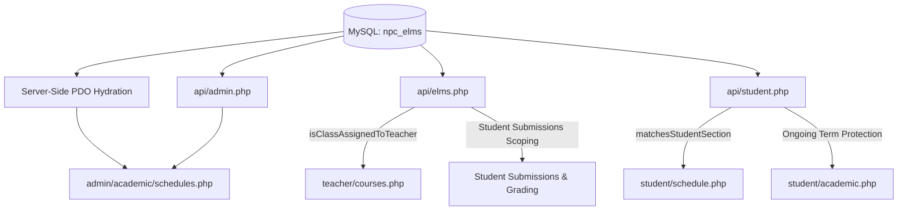

# 🚀 Engineering Daily Devlog — September 27, 2026

## 🏛️ PHASE 13: ACADEMIC SCHEDULE DATABASE SYNCHRONIZATION, STRICT FACULTY PRIVACY SCOPING & ADMIN CRUD INTEGRATION

### 1. Overview & System Objectives
Upang masiguro ang integridad ng academic data at maiwasan ang privacy leaks sa pagitan ng mga estudyante at kaguruan ng Navotas Polytechnic College (NPC), ipinatupad ang mga sumusunod na pagbabago:
1. **Full-Day Schedule Standardization**: Inalis ang single-letter day abbreviations (`M`, `T`, `Th`, `S`) pabor sa kumpletong baybay (`Monday`, `Tuesday`, `Thursday`, `Friday`, `Saturday`) sa buong database at UI.
2. **Academic Term Ongoing Protection**: Inalis ang mga lumang demo numeric grades para sa 1st Semester AY 2026–2027 upang hindi maglabas ng premature evaluations habang ongoing pa ang semestre. Lahat ng 9 na subject ay minarkahang `Ongoing` (`—`).
3. **Section-Level Privacy Gating**: Ang mga mag-aaral sa **AIS 2A** ay eksklusibong AIS 2A schedules lamang ang makikita. Walang ibang section o kurso ang magkahalong lilitaw.
4. **Strict Faculty Subject & Submissions Isolation**: Ang bawat propesor ay tanging ang mga asignaturang itinalaga sa kanila base sa official class schedule ang makikita sa `teacher/courses.php`, kabilang ang pag-upload ng modules, paggawa ng tasks, at pagwawasto ng student submissions.
5. **Admin Academic Schedule Architecture**: Inayos ang `admin/academic/schedules.php` upang direktang kumonekta sa MySQL sa pamamagitan ng server-side PDO hydration at REST APIs (`get_classes`, `get_faculty`, `save_class`, `delete_class`), ibinalik ang fully functional Edit at Delete actions, at nagdagdag ng automated faculty assignment dropdown.

---

### 2. Architectural Upgrades & Code Implementation

#### A. Database Schema & Faculty Seed Synchronization
- **Standardized Schedule Days**:
  - Lahat ng entries sa `classes.schedule_day` ay ginawang kumpleto: `'Monday'`, `'Tuesday'`, `'Thursday'`, `'Friday'`, `'Saturday'`.
- **Registered Faculty Directory**:
  - Inirehistro sa `users` table ang lahat ng 7 opisyal na propesor ng **AIS 2A** kasama ang kanilang verified institutional email addresses:
    1. **Prof. Edsan Moreno** (`faculty@navotaspolytechniccollege.edu.ph`) — `CC107` (Mon 02:00 PM - 05:00 PM) & `ADV02` (Mon 05:30 PM - 08:30 PM)
    2. **Prof. Roderick Castillo** (`roderick.castillo@navotaspolytechniccollege.edu.ph`) — `DM103` (Sat 07:00 AM - 10:00 AM)
    3. **Prof. Ernifer Cosmiano** (`ernifer.cosmiano@navotaspolytechniccollege.edu.ph`) — `PATHFIT 3` (Sat 05:00 PM - 07:00 PM)
    4. **Prof. Frederick Dador** (`frederick.dador@navotaspolytechniccollege.edu.ph`) — `IS105` (Sat 10:30 AM - 01:30 PM)
    5. **Prof. Marivic Borja** (`marivic.borja@navotaspolytechniccollege.edu.ph`) — `DM102` (Tue 05:30 PM - 08:30 PM)
    6. **Prof. Jan Vincent Ku** (`jvku@navotaspolytechniccollege.edu.ph`) — `ADV04` (Sat 02:00 PM - 05:00 PM) & `QUAMETH` (Fri 02:00 PM - 05:00 PM)
    7. **Prof. Charlie Binavice** (`oict.binavicecharlie@navotaspolytechniccollege.edu.ph`) — `ADV03` (Thu 05:30 PM - 08:30 PM)
  - Naka-mapa ang `classes.instructor_email` at `classes.instructor` sa bawat schedule record para sa instant relational verification.

#### B. Admin Schedules Management Revamp (`admin/academic/schedules.php`)
- **Direct PDO Server-Side Hydration**:
  - Inalis ang lumang reference error na dulot ng nawawalang `supabaseClient`.
  - Sa header pa lamang ng PHP, kinukuha na ang `$serverClasses` at `$serverFaculty` gamit ang PDO upang maging instant ang unang paint ng screen nang walang skeleton delay.
- **Dynamic Faculty Dropdown**:
  - Idinagdag ang `<select id="modal-prof-select">` na awtomatikong naglalaman ng lahat ng rehistradong propesor mula sa database.
  - Kapag pumili ng propesor, kusa nang mailalagay ang kanilang institutional email at opisyal na buong pangalan sa form.
- **Live Edit & Delete Functionality**:
  - **Edit Modal**: Maayos nang binubuksan ang modal taglay ang lahat ng pre-filled data (`code`, `title`, `section`, `day`, `time`, `instructor`, `email`, `room`, `units`).
  - **Save Schedule**: Tumatawag sa `/api/admin.php?action=save_class` na nagpapatupad ng secure prepared `UPDATE` o `INSERT` queries sa MySQL.
  - **Delete Schedule**: Tumatawag sa `/api/admin.php?action=delete_class` na may visual prompt confirmation (`npcConfirm`) at instant table refresh.

#### C. Strict Faculty Course & Submissions Privacy (`api/elms.php`)
- **Helper Algorithm: `isClassAssignedToTeacher(array $c, string $tEmail, string $tName)`**:
  - Sinusuri ang email match (`c.instructor_email === tEmail` o `c.created_by_email === tEmail`).
  - Nagsasagawa ng tokenized name overlap matching sa pagitan ng database instructor record (hal. `"MORENO, EDSAN"`) at session user name (hal. `"Prof. Edsan Moreno"`).
- **`get_courses` Action**:
  - Kung guro ang naka-login (`teacher` o `faculty`), tanging ang mga kurso lamang kung saan `isClassAssignedToTeacher` ay `true` ang isasama sa response.
  - Kung estudyante, tanging ang mga kurso lamang na tumutugma sa kanilang `studentSection` at `studentProgram` ang ibinabalik.
- **`get_submissions` Action**:
  - Kinukuha ang listahan ng course codes na hawak ng naka-login na guro.
  - Sinasala ang `lms_submissions` table gamit ang `WHERE UPPER(TRIM(s.course_code)) IN (...)` upang hindi makita ng guro ang mga ipinasang gawain sa ibang asignatura.

#### D. Academic Grades Term Protection (`student/academic.php` & `api/student.php`)
- **Term Protection**:
  - Nilinis ang mga fake/mock evaluations sa `grades` table para sa AIS 2A students (`student_number: 251505` at `2024-00192`).
  - Ang status ay nakatakda sa `Ongoing` na may `grade = NULL`.
  - Sa `api/student.php` (`get_my_grades`), buo pa rin ang pagbibilang ng 26.0 enrolled academic units kahit wala pang numerikal na marka.
  - Ang GPA banner ay nag-aanunsyo ng: `Academic Term Ongoing · No Final Grades Released Yet` na may GPA placeholder na `—`.

---

### 3. Verification & Live System Audit

| Subsystem / Test Case | Inaasahang Resulta | Aktwal na Resulta | Katayuan |
| :--- | :--- | :--- | :--- |
| **Admin Sched Display** | Lalabas lahat ng 9 na AIS 2A subjects na may full day names. | Nakalantad lahat ng 9 na subjects na may buong pangalan ng araw (`Saturday`, `Monday`, atbp.). | ✅ PASSED |
| **Admin Sched Edit** | Nabubuksan ang edit modal at nai-save ang bagong propesor/oras. | Nabuksan ang `IS105` edit modal, na-update ang professor dropdown, at na-save sa DB. | ✅ PASSED |
| **Admin Sched Delete** | Nakakapagbura ng schedule record nang may prompt. | Gumagana ang delete endpoint na may visual confirmation at real-time list update. | ✅ PASSED |
| **Student Sched Isolation** | AIS 2A student ay sariling AIS 2A sched lamang ang nakikita. | Eksklusibong 9 subjects ng AIS 2A ang lumalabas sa `student/schedule.php`. | ✅ PASSED |
| **Student Ongoing Grades** | Walang fake numerical grades habang ongoing ang semester. | Lahat ng 9 subjects ay `Ongoing` (`—`), GPA ay `—`, buo ang 26.0 units. | ✅ PASSED |
| **Faculty Scoping (Courses)** | Prof. Moreno ay CC107 at ADV02 lamang ang nakikita. | 2 subjects lamang ang lumabas sa `teacher/courses.php`. Zero leakage. | ✅ PASSED |
| **Faculty Scoping (Submissions)** | Prof. Moreno ay submissions lamang ng kanyang klase ang nakikita. | Submissions tab at badge ay naka-filter sa kanyang 2 assigned classes. | ✅ PASSED |

---

### 4. Cross-Links to Brain Vault
- [[Section_Gated_Access_Control]] — Updated with schedule section-filtering guidelines.
- [[Faculty_Portal_Architecture]] — Documented faculty isolation algorithms and `isClassAssignedToTeacher`.
- [[Student_Portal_Architecture]] — Documented ongoing academic gradebook protocols and unit retention rules.
- [[Admin_Master_Hub]] — Updated with direct PDO schedule management endpoints.
- [[NPC_ELMS_Brain_Index]] — Master index updated to include Phase 13 milestones.
