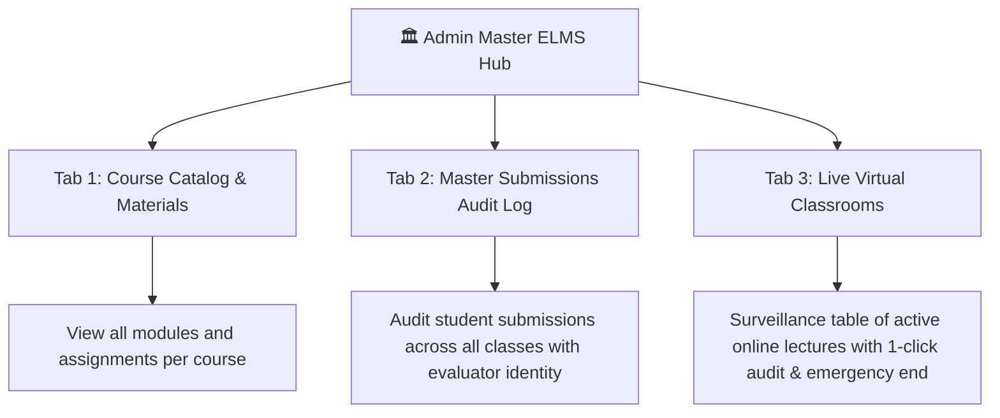

# 🏛️ Admin Master ELMS Hub & Institutional Oversight

Located at [admin/academic/elms.php](file:///c:/Users/Lovi/Downloads/llama-b10483-bin-win-cpu-x64/LocalAI/app/admin/academic/elms.php), the **Admin Master ELMS Hub** provides executive-level campus management, compliance auditing, and central control.

Connected Nodes:
- Central Brain: [[NPC_ELMS_Brain_Index]]
- Live Broadcasts: [[Admin_Live_Audit_Center]]
- Calendar Sync: [[Academic_Calendar_and_Events]]
- Security Audit: [[Security_and_Audit_Logging]]

---

## 📈 1. Campus-Wide Metrics Dashboard
The Master Hub aggregates real-time indicators across all collegiate departments:
- **Total Registered Courses**: Full curriculum catalog (AIS, CS, HCI, IS).
- **Uploaded Learning Modules**: Total lecture PDFs and slide decks.
- **Active Coursework Tasks**: Active capstone assignments and problem sets.
- **Student Submissions Recorded**: Submission compliance and completion rates.

---

## 📑 2. The 3 Master Hub Tabs

---
*Backlinks: [[NPC_ELMS_Brain_Index]] | [[Admin_Live_Audit_Center]] | [[Security_and_Audit_Logging]]*
