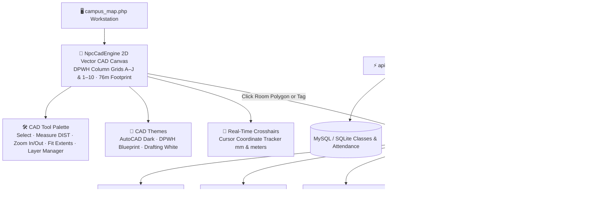

# 🏛️ NPC Campus Architectural CAD Blueprint Workstation

> [!info] Executive Summary & Pure 2D AutoCAD Blueprint Mode
> Kasunod ng user request (*"remove mo nlng yung 3D maaap"*):
> 
> Ang **NPC Campus Workstation** (`campus_map.php`) ay 100% nang **2D AutoCAD Vector Architectural Blueprint** na walang anumang 3D overhead, 3D lag, o 3D map elements:
> 1. **Complete Removal of 3D Map**: Tinanggal nang buo ang 3D floorplan viewport container, 3D mode toggles, at 3D camera controls. Ang buong interface ay nakatutok sa ultra-fast, zero-lag 2D AutoCAD Vector Blueprint engine.
> 2. **Professional DPWH Vector Linework**: 100% tuwid na double-line concrete walls, structural column grid bubbles A–J (horizontal) at 1–10 (vertical), 90° architectural door swing arcs, window mullion glazing, at metric dimension strings sa bawat bay (8.0m spacing).
> 3. **CAD Workstation Controls**: Nilagyan ng active Select tool, Tape Measure tool (`DIST`), Smooth Zoom In/Out, Fit / Zoom Extents, at AutoCAD Layer Manager (`A-WALL`, `A-DOOR`, `A-GLAZ`, `A-COLS`, `A-DIMS`, `S-GRID`, `A-ROOM`, `A-FURN`, `A-STAT`).
> 4. **Three Professional CAD Themes**: AutoCAD Classic Dark (`#0b0f17`), DPWH Blueprint Navy (`#081a36`), at Architectural Technical White (`#f8fafc`).
> 5. **Hotel-Style Room Inspector Card**: Nananatiling 100% gumagana ang kumpletong pagsusuri ng kwarto: Room Name & Code, Class Section (hal. `AIS-2A`), Course Title (hal. `GE104`), Assigned Professor, at Live Attendance Headcount (Present, Late, Absent, % rate, animated progress bar, at live RFID swipe logs).

---

## 🏗️ 1. Architectural 3D BIM Model (Blender 5.2 & Three.js)

### Procedural Generation Pipeline (`a.py`)
Ang 3D campus model ay binuo gamit ang Python script sa loob ng Blender 5.2 (`bpy`, `bmesh`):
- **Super-Expanded Building Footprint (76m × 76m)**: Pinalaki nang husto ang sukat ng gusali mula sa 56m × 60.5m tungo sa **76.0m × 76.0m** upang magkaroon ng maluwag na espasyo ang bawat pasilidad at hindi mag-overflow ang mga silid.
- **Central Open Lightwell (18m × 18m)**: Gitnang open atrium void sa 1F, 2F, 3F, at RD na may glass balustrade railings para sa modernong architectural flow.
- **Dedicated Solid 4F Slab para sa Gymnasium Arena**:
  - Ang 4F floor slab ay ginawang **solid** (walang open void) upang ang **42m × 30m Multi-Purpose Gymnasium Arena** (`4F-GYM`) ay 100% nakapatong sa reinforced concrete floor plate nang walang clipping o paglagpas.
  - Nilagyan ng FIBA 28m × 15m hardwood maple court, 5-tier spectator bleachers (30m lapad), blue player benches, scorer table, FIBA blue stanchion hoops, at perimeter sports wainscot walls (Warm Oak sa ibaba, Academic Navy sa itaas, at gold trim).
- **Vibrant Architectural Wall Coloring ("lagyan mo kulay yung mga pader")**:
  - **Academic Navy Accent Walls (`#0a1e3f` / `NPC_Wall_Accent_Navy`)**: Front feature walls sa bawat classroom kung saan nakakabit ang glassboard at projector screen.
  - **Warm Sand Cream Walls (`#f1ede4` / `NPC_Wall_Warm_Cream`)**: Maaliwalas at eleganteng side/rear walls para sa mga lecture rooms.
  - **Tech Blue & Slate (`#0284c7` & `#1e293b`)**: Modern high-tech styling para sa Computer Laboratories 1 & 2.
  - **Glazed Aqua Teal (`#0d9488` / `NPC_Wall_Restroom_Teal`)**: Makintab na ceramic tile walls at partitions sa lahat ng CR.
  - **Institutional Navy Columns (`#001736` / `NPC_Column_Navy`)**: Deep navy structural columns sa 10×10 grid nodes (Grids A to J, 1 to 10 sa 8.0m spacing).
  - **Dark Charcoal Capping (`#11161d`)**: Crisp outline rim sa tuktok ng mga pader para sa sharp CAD blueprint line definition.
- **Export Pipeline**: Direct GLTF/GLB binary export (`assets/models/npc_campus_blender.glb` ~3.50 MB) na may Blender 5.2.2 LTS compatibility.

### Three.js Client Engine (`assets/js/npc-blender-3d.js`)
- **OrbitControls Integration**: Smooth pan, rotate, and zoom bounds (`minDistance: 8`, `maxDistance: 250`).
- **Interactive Raycasting**: Mouse hover and click raycasting laban sa room meshes na may visual glow outline at dynamic hover tooltip.
- **Floor Slicing Engine**: Agarang pagsasara/pagbubukas ng floor slabs gamit ang `setFloor(floorId)`. Kapag pinili ang `2F`, awtomatikong tinatago ang 3F, 4F, at Roof Deck slabs para maging bukas ang dollhouse view ng mga classroom.
- **First-Person Walk Mode**: Full WASD keyboard navigation + mouse look para makapaglakad ang estudyante o guro sa loob ng corridors at hallways ng NPC campus.

---

## 📐 2. 2D AutoCAD Architectural Blueprint Engine (`assets/js/npc-campus-cad.js`)

> [!tip] Professional CAD Invariant
> Ginaya ang tunay na blueprint standards ng DPWH at Philippine National Building Code:
> - **Grid Bubbles**: Column lines (Letters A–J horizontally, Numbers 1–10 vertically sa 8.0m bay spacing, 72m centerline span, 76m exterior boundary).
> - **Line Hierarchy**: Cyan thick exterior perimeter walls, light blue partition walls, yellow door swing arcs (90° swing), at blue-tinted window glass.
> - **Interactive Measurement Tape**: Crosshair cursor na may live real-world meter measurement (`dx`, `dy`, `distance in meters`).
> - **Theme Support**: AutoCAD Classic Dark (`#0b0f17`), Architecture Blueprint Blue (`#002147`), at Clean White High-Contrast.

---

## ⚡ 3. Real-Time Spatial REST API (`api/campus_map.php`)

Nagsisilbing backend bridge sa pagitan ng physical architecture at academic database:

| Action | Endpoint | Output / Purpose |
|---|---|---|
| `get_all` | `/api/campus_map.php?action=get_all` | Buong campus spatial hierarchy: 35+ rooms, real-time live availability (vacant vs. in-use), dynamic timetables, at faculty directory. |
| `get_floor` | `/api/campus_map.php?action=get_floor&floor=2F` | Targeted floor plan data para sa fast 2D CAD vector rendering. |
| `get_room` | `/api/campus_map.php?action=get_room&id=2F-11` | Kumpletong metadata ng espisipikong kwarto (e.g. Comp Lab 2: area 92.5 m², 45 seats, ACU specs). |
| `get_faculty` | `/api/campus_map.php?action=get_faculty` | Listahan ng mga propesor at ang kanilang kasalukuyang opisina o aktibong classroom. |

---

## 📱 4. Unified Room Inspector & Faculty Locator

1. **Room Inspector Card**:
   - Drawer na sumusulpot mula sa kanang bahagi (`#room-inspector`) kapag nag-click ng kahit anong kwarto sa 3D o 2D view.
   - Ipinapakita ang **Live Status Badge** (Green `Available / Vacant` o Red `In-Use / Class Ongoing`).
   - Kasalukuyang nakatalagang guro kasama ang avatar at email link.
   - Araw-araw na **Class Timetable** na hinugot mula sa institutional database.
   - Pindutan ng **"Copy Room Link"** para sa pagbabahagi ng direct URL parameters (`?room=2F-11`).

2. **Faculty Locator Drawer**:
   - Search bar para sa mabilisang paghahanap ng propesor (e.g. "Jilo Derramas", "Alan Turing", "Santos").
   - Ipinapakita kung saang palapag at kwarto matatagpuan ang guro.
   - Isang pindot lang sa **"Locate"**, awtomatikong lulipad ang 3D camera papunta sa pintuan ng nasabing opisina o classroom.

---

## 🔗 5. Bidirectional Knowledge Links
- [[2026-09-19]] — Daily devlog detailing Phase 12 CAD & BIM deployment and smoke tests.
- [[ThreeJS_3D_Graphics_Engine]] — Ambient node background, dual-theme shaders, and WebGL rendering pipeline.
- [[NPC_ELMS_Brain_Index]] — Central MOC connecting all academic subsystems.
- [[Student_Portal_Architecture]] — Direct navigation integration for student class location lookup.
- [[Faculty_Portal_Architecture]] — Faculty schedule and classroom assignment synchronization.
