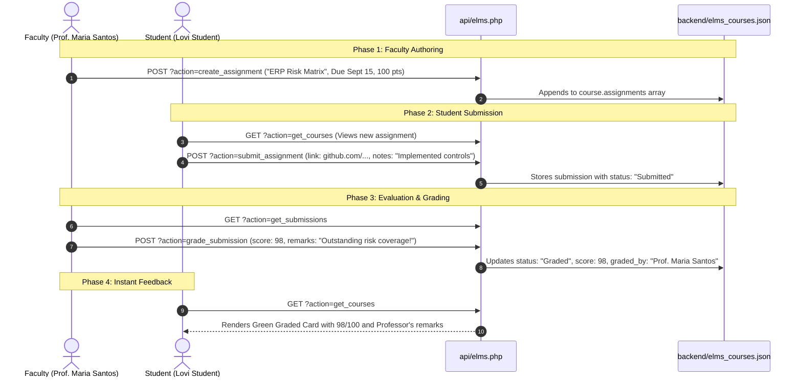

# 📝 Coursework & Grading Engine (Interconnected Lifecycle)

The **Coursework & Grading Engine** connects professors and students into a real-time feedback loop, fulfilling the user directive:
> *"mag connect connect silaaa"*

Connected Nodes:
- Central Brain: [[NPC_ELMS_Brain_Index]]
- Student Hub: [[Student_Portal_Architecture]]
- Faculty Hub: [[Faculty_Portal_Architecture]]
- Storage Backend: [[Database_and_Storage_Architecture]]

---

## 🔄 1. Complete End-to-End Cycle



---

## 💾 2. Submission Data Model
Stored hierarchically in `backend/elms_courses.json`:
```json
{
  "id": "SUB-1788950853",
  "assignment_id": "ASG-001",
  "student_id": "dev-student-id-001",
  "student_name": "Lovi Student",
  "student_number": "2024-00192",
  "course_code": "AIS 201",
  "submitted_link": "https://github.com/npc-students/erp-control-matrix-lovi",
  "notes": "Prelim Capstone problem solved with modular segregation of duties matrix.",
  "submitted_at": "2026-09-09T18:47:33+08:00",
  "status": "Graded",
  "score": 98,
  "remarks": "Outstanding work! Thorough risk mitigation coverage for vendor invoice processing.",
  "graded_by": "Prof. Maria Santos",
  "graded_at": "2026-09-09T18:48:10+08:00"
}
```

---
*Backlinks: [[NPC_ELMS_Brain_Index]] | [[Student_Portal_Architecture]] | [[Faculty_Portal_Architecture]]*
