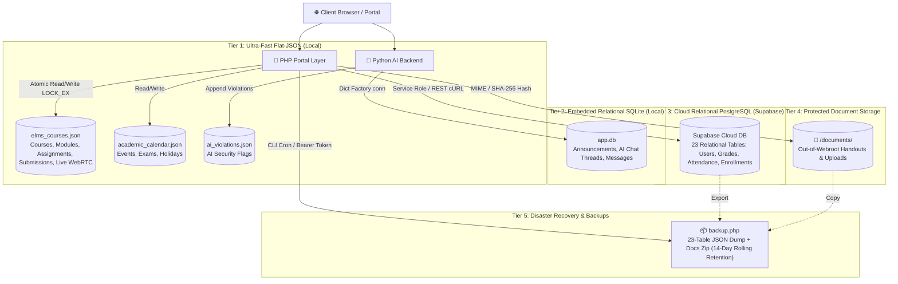
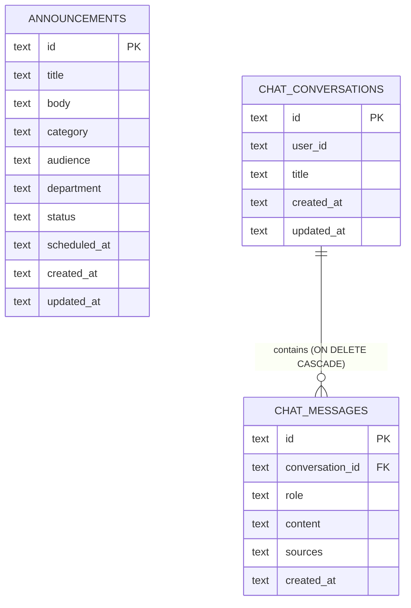
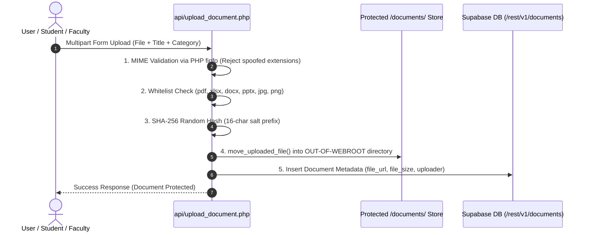
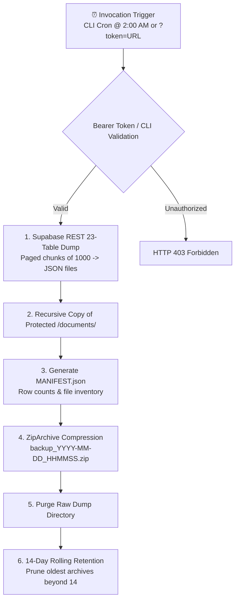

# 💾 Database & Multi-Tier Storage Architecture

The **Navotas Polytechnic College ELMS** implements an ultra-resilient, hybrid multi-tier storage model. To deliver microsecond UI responsiveness during peak campus hours alongside institutional compliance, the system combines **Zero-Latency Flat-JSON Datastores**, an **Embedded Local SQLite Database**, and an enterprise **Cloud Relational Supabase (PostgreSQL) Service Layer**.



---

## 🗄️ 1. Connected Knowledge Nodes
- Central Brain Index: [[NPC_ELMS_Brain_Index]]
- Coursework & Grading Loop: [[Coursework_and_Grading_Engine]]
- Real-Time Virtual Classrooms: [[Virtual_Classroom_WebRTC]]
- Section Isolation & Access Control: [[Section_Gated_Access_Control]]
- Campus Security & Audit Logs: [[Security_and_Audit_Logging]]
- Master Administrative Surveillance: [[Admin_Master_Hub]]

---

## ⚡ 2. Tier 1: Zero-Latency Flat-JSON Datastores (`backend/`)

For hyper-dynamic workflows such as live virtual class broadcasting, module distribution, coursework assignment submissions, and institutional calendars, flat JSON storage provides microsecond read/write execution with zero database round-trips and zero external dependency risk.

### A. `backend/elms_courses.json`
Acts as the operational core for the ELMS classroom.
- **Concurrency Safety**: Written using PHP `file_put_contents(..., LOCK_EX)` to ensure atomic transactions during simultaneous student submissions.
- **Data Schema**:
```json
[
  {
    "code": "AIS 201",
    "title": "Accounting Information Systems",
    "instructor": "Prof. Maria Santos",
    "section": "2A",
    "units": 3,
    "schedule": "Mon/Wed 9:00 AM - 10:30 AM",
    "room": "Lab 3",
    "description": "Exploration of modern accounting software, internal controls, audit trails, and financial reporting systems.",
    "live_session": {
      "is_active": false,
      "topic": "",
      "started_at": null,
      "ended_at": null,
      "started_by": "",
      "room_id": "",
      "allowed_section": "2A",
      "platform": "jitsi"
    },
    "modules": [
      {
        "id": "mod-ais-01",
        "title": "Module 1: Introduction to Accounting Information Systems",
        "file_name": "AIS_Module1_Overview.pdf",
        "file_size": "2.4 MB",
        "uploaded_at": "2026-09-02"
      }
    ],
    "assignments": [
      {
        "id": "asg-ais-01",
        "title": "Case Analysis: Internal Controls in Banking",
        "due_date": "2026-09-25",
        "points": 100,
        "instructions": "Analyze the case scenario and submit a 3-page evaluation report in PDF format."
      }
    ],
    "submissions": [
      {
        "id": "sub-1725890000",
        "assignment_id": "asg-ais-01",
        "student_id": "2024-00192",
        "student_name": "Administrator Dev",
        "student_email": "admin@npc.edu.ph",
        "student_section": "2A",
        "file_name": "AIS_Case_Analysis_2024_00192.pdf",
        "file_path": "uploads/submissions/sub_1725890000.pdf",
        "file_size": "1.2 MB",
        "submitted_at": "2026-09-09 23:45:00",
        "status": "graded",
        "grade": 96,
        "feedback": "Outstanding depth of analysis and thorough risk evaluation."
      }
    ]
  }
]
```

### B. `backend/academic_calendar.json`
Stores the institutional schedule partitioned chronologically by `YYYY-MM-DD` date keys:
```json
{
  "2026-09-01": [
    {
      "id": "ev-001",
      "title": "Start of 1st Semester Classes",
      "type": "academic",
      "desc": "Opening of regular synchronous & in-person lectures across all programs."
    }
  ],
  "2026-09-15": [
    {
      "id": "ev-003",
      "title": "Prelim Examination Week Begins",
      "type": "exam",
      "desc": "Preliminary examinations across all collegiate programs."
    }
  ]
}
```

### C. `backend/ai_violations.json`
Stores real-time policy flags, banned keyword triggers, and anomalous rate-limit attempts intercepted by the AI query engine (`backend/query_ai.py`).

---

## 🗃️ 3. Tier 2: Embedded Relational SQLite Database (`app.db`)

Managed by Python (`backend/database.py`), the SQLite engine provides indexed relational storage for campus news feeds, announcements, and contextual AI chat histories.

### Schema Architecture


- **Connection Optimization**: Utilizes `sqlite3.connect(db_path)` with custom `dict_factory` mapping cursor rows to associative key-value dictionaries.
- **Cascade Pruning**: Relies on foreign keys with `ON DELETE CASCADE` so deleting a user chat thread instantly purges associated prompt and completion tokens.

---

## ☁️ 4. Tier 3: Cloud Relational Supabase (PostgreSQL)

Enterprise institutional data is synchronized and mastered in **Supabase PostgreSQL** via PostgREST endpoints handled by [api/supabase_helper.php](file:///c:/Users/Lovi/Downloads/llama-b10483-bin-win-cpu-x64/LocalAI/app/api/supabase_helper.php).

### Institutional Table Manifest (23 Monitored Tables)
| Domain | Monitored Relational Tables |
| :--- | :--- |
| **Identity & Access** | `users`, `profile_update_requests`, `security_logs` |
| **Academic Directory** | `school_years`, `semesters`, `programs`, `sections`, `subjects` |
| **Classroom & Roster** | `classes`, `enrollments`, `user_class_enrollments` |
| **Attendance Tracking** | `attendance_records`, `attendance_sessions` |
| **Grading Engine** | `grades`, `grade_submissions`, `grade_change_requests` |
| **Faculty & Services** | `faculty_materials`, `consultation_appointments`, `document_requests` |
| **Communications** | `announcements`, `class_announcements`, `notifications` |
| **System Settings** | `app_settings` |

### Security Boundary: Service Role vs Public Key
- **Browser Clients**: Interact strictly through the institutional backend proxy; client scripts never hold the Supabase master administrative secret.
- **Backend Communication**: Authorized via `SUPABASE_SERVICE_ROLE_KEY` over TLS cURL requests utilizing HTTP headers:
  ```http
  apikey: <SUPABASE_SERVICE_ROLE_KEY>
  Authorization: Bearer <SUPABASE_SERVICE_ROLE_KEY>
  Range: 0-999
  Prefer: count=exact
  ```

---

## 🔒 5. Tier 4: Protected Document & Binary Asset Pipeline

Campus handouts, faculty syllabi, student coursework attachments, and official registrar requests are secured using a defense-in-depth storage pipeline:



1. **Out-of-Webroot Placement**: File uploads are stored outside the public document root (`dirname(__DIR__) . '/documents'`), preventing direct HTTP execution or path disclosure.
2. **Server-Level `.htaccess`**: Employs a blanket `Require all denied` configuration within upload folders as secondary defense.
3. **Randomized Hash Naming**: Files receive an irreversible hash name:
   `$filename = substr(hash('sha256', uniqid('', true) . $file['name']), 0, 16) . '.' . $ext;`
4. **MIME Sniffing**: Uses PHP `finfo(FILEINFO_MIME_TYPE)` rather than trusting client-provided HTTP content types.
5. **Session-Authenticated Streaming**: Files are served exclusively through [download_material.php](file:///c:/Users/Lovi/Downloads/llama-b10483-bin-win-cpu-x64/LocalAI/app/download_material.php) with role and enrollment verification prior to streaming binary chunks.

---

## 📦 6. Tier 5: Disaster Recovery & Automated Backup Subsystem (`backend/backup.php`)

To guarantee business continuity and satisfy institutional accreditation standards, the NPC ELMS includes an automated, self-contained backup engine:



### Key Backup Capabilities:
- **Dual Execution Vectors**:
  - **CLI (Automated Server Cron)**: `php backend/backup.php` (scheduled daily at 2:00 AM).
  - **Web URL with Bearer Token**: `backup.php?token=<BACKUP_TOKEN>` utilizing timing-safe `hash_equals()`.
- **Chunked REST Ingestion**: Paginates large database tables in blocks of 1,000 records via HTTP `Range: offset-(offset+999)` headers until full exhaustion.
- **Space Optimization**: Instantly deletes unpacked working directories after `.zip` compression is confirmed.
- **Automated Retention Cycle**: Preserves the latest **14 snapshots** (`$retention = 14`), automatically purging expired zips to avoid disk overflow.

---

## 📁 7. Clean Modular Directory Topology (Zero Root Clutter)

All institutional code and persistent assets conform to strict domain boundaries:

```
LocalAI/app/
├── admin/               # Administrative master controls & academic portals
│   ├── academic/        # ELMS course directory & live monitoring
│   └── importers/       # Bulk student, faculty & schedule batch parsers
├── teacher/             # Faculty workspace, grading desk, live broadcast hub
├── student/             # Student dashboard, assignments, schedule, QR attendance
├── api/                 # Centralized REST services (elms.php, faculty.php, student.php)
├── includes/            # Core PHP includes (_head.php, _sidebar.php, auth.php)
├── backend/             # Persistent JSON stores, SQLite app.db, Python AI server
│   ├── elms_courses.json
│   ├── academic_calendar.json
│   ├── ai_violations.json
│   ├── database.py
│   ├── backup.php
│   └── backups/         # Compressed timestamped institutional zip archives
├── assets/              # Static styling, Three.js 3D engine, client libraries
│   ├── css/styles.css
│   └── js/ (npc.js, npc-three.js, three.min.js)
├── documents/           # Out-of-webroot protected file uploads
└── obsidian/            # Architecture vault & institutional knowledge graph
```

---
*Backlinks: [[NPC_ELMS_Brain_Index]] | [[Coursework_and_Grading_Engine]] | [[Virtual_Classroom_WebRTC]] | [[Security_and_Audit_Logging]] | [[Admin_Master_Hub]]*
