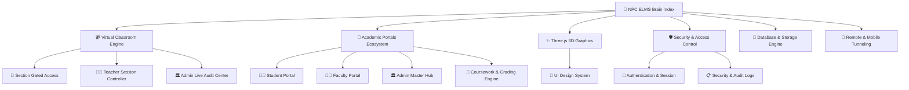

# 🧠 Navotas Polytechnic College — ELMS Knowledge Brain & System Index

Welcome to the central **Map of Content (MOC)** for the **NPC Electronic Learning Management System (ELMS)**. This knowledge vault maps out every architectural layer, real-time subsystem, security barrier, and visual component that powers the institution.

---

## 🏛️ 1. Core Architecture & Central Hubs
- [[Virtual_Classroom_WebRTC]] — Walang limitasyong WebRTC virtual meeting, zero 40-minute limit, unlimited participants.
- [[Student_Portal_Architecture]] — Handout downloads, coursework submission, instant grade feedback cards, live broadcast banner.
- [[Faculty_Portal_Architecture]] — Module publishing, homework authoring, live evaluation table, start/end virtual class.
- [[Admin_Master_Hub]] — Campus-wide statistics, course directory, master submissions compliance audit, live broadcast surveillance.

---

## 🔒 2. Security, Access Isolation & Permissions
- [[Section_Gated_Access_Control]] — Mahigpit na paghihiwalay ng section (`Section 2A` vs `Section 3B`), zero indicator leak, HTTP 403 barrier.
- [[Teacher_Session_Controller]] — Eksklusibong On/Off controls ng guro; mga estudyante ay Join privileges lamang.
- [[Authentication_and_Session_State]] — PHP session lifecycle, role authorization, CSRF protection, dev login switcher.
- [[Security_and_Audit_Logging]] — Campus audit trail, tamper prevention, automated moderation, database logging.

---

## 🎨 3. Visual FX, 3D Engine & User Experience
- [[Campus_CAD_and_3D_BIM_Workstation]] — 3D Blender BIM architectural model, 2D AutoCAD vector blueprint, floor slicer, live room inspector, at faculty locator.
- [[ThreeJS_3D_Graphics_Engine]] — Ambient node constellation field, 3D login hero terrain, gold orbit rings, holographic AI core.
- [[UI_Design_System_and_Tailwind]] — NPC Navy & Gold palette, dark/light theme tokens, glassmorphism, micro-animations.
- [[Academic_Calendar_and_Events]] — Live header date & clock, admin calendar event editor, synced academic timelines.

---

## 💾 4. Data Engines & Academic Pipelines
- [[Coursework_and_Grading_Engine]] — Complete teacher-student submission & grading loop (numerical scores + personalized qualitative feedback).
- [[Database_and_Storage_Architecture]] — Multi-tier hybrid model: Zero-latency JSON stores, embedded SQLite app.db, 23-table Supabase PostgreSQL sync, protected document pipeline, and 14-day rolling backups.
- [[Mobile_and_Remote_Tunneling]] — Permanent ngrok HTTPS live link, trycloudflare fallback, mobile camera/mic permissions.

---

## 📜 5. Evolutionary History & Timelines
- [[2026-09-27]] — Daily devlog detailing Phase 13 Academic Schedule Database Synchronization, Strict Faculty Privacy Scoping & Admin Schedule Management.
- [[2026-09-19]] — Daily devlog detailing Phase 12 Architectural CAD Blueprint & Blender 3D BIM Workstation.
- [[2026-09-09]] — Comprehensive engineering daily log spanning Phase 1 to Phase 11.
- [[Untitled.canvas]] — Visual Obsidian Canvas node board mapping out the brain relationships.

---
*Created for Navotas Polytechnic College Academic Management System.*
