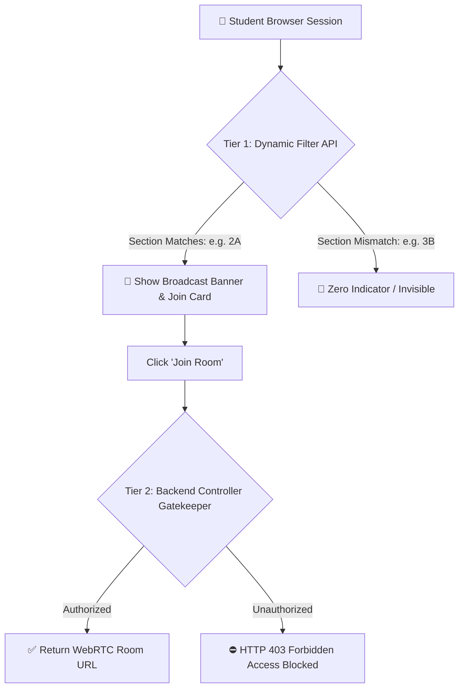

# 🎯 Section-Gated Access Control & Privacy Barrier

A fundamental requirement of the NPC ELMS is **strict section isolation**:
> *"yung section lng pwede mag pwede maka pasok kunwari section ko yun lng makakita pag online"*

Connected Nodes:
- Virtual Meeting Engine: [[Virtual_Classroom_WebRTC]]
- Student User Experience: [[Student_Portal_Architecture]]
- Central Authentication: [[Authentication_and_Session_State]]
- Brain Index: [[NPC_ELMS_Brain_Index]]

---

## 🛡️ 1. Two-Tier Privacy Defense



### Tier 1: Zero-Leak Visual Gating (`api/elms.php?action=get_live_sessions`)
- When a student fetches active live classes, the API inspects `$_SESSION['section']`.
- If the course belongs to `Section 2A`, only students enrolled in `2A` receive live session records.
- Students in other sections (e.g. `Section 3B`) receive an empty array `[]`. They see **zero banners, zero badges, and zero distractions**.

### Tier 2: Server-Side Authorization Barrier (`api/elms.php?action=join_live_class`)
- Even if a student discovers the course code or attempts to forge a direct request:
```php
if (!matchesStudentSection($studentSection, $courseSection)) {
    http_response_code(403);
    echo json_encode([
        'status' => 'error',
        'message' => 'Access Restricted: This virtual classroom is exclusively reserved for Section ' . $course['section'] . '. Your current section is ' . $studentSection . '.'
    ]);
    exit();
}
```
- Direct unauthorized entry is blocked with HTTP 403 Forbidden.

---

## 🔍 2. Fuzzy & Normalized Section Matching
The matching engine `matchesStudentSection()` resolves multiple institutional formats:
1. **Exact match**: `2A` == `2A`
2. **Program-prefixed**: `AIS-2A` or `BSCS 2A` matches `2A`
3. **Dash / Space normalization**: Handles `SEC 2A`, `2-A`, and `Section 2A` without false negatives.

---

## 👨‍🏫 3. Class Schedule & Faculty Isolation (Phase 13: 2026-09-27)
- **Student Schedule Privacy**:
  - `student/schedule.php` strictly filters `classes` records via `matchesStudentSection()`. An `AIS 2A` student exclusively accesses `AIS 2A` subjects.
- **Faculty Subject & Submission Isolation**:
  - `teacher/courses.php` and `api/elms.php` enforce `isClassAssignedToTeacher(array $class, string $teacherEmail, string $teacherName)`.
  - Professors only see their assigned courses, published modules, and student coursework submissions (zero cross-course leakage).
- **Audit Devlog**: See [[2026-09-27]].

---
*Backlinks: [[Virtual_Classroom_WebRTC]] | [[Teacher_Session_Controller]] | [[Student_Portal_Architecture]] | [[2026-09-27]]*
