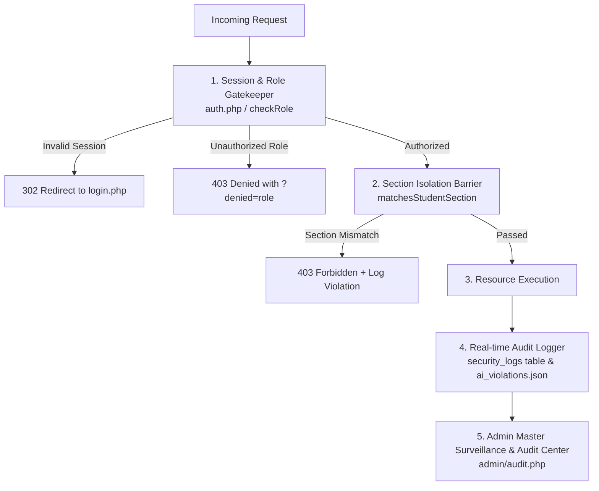

# 🛡️ Security & Institutional Audit Logging Engine

The **Security & Audit Logging Engine** continuously enforces role-based access control (RBAC), section isolation, data tampering prevention, and activity surveillance across the entire Navotas Polytechnic College digital ecosystem.

---

## 📜 1. Security Event Taxonomy

Every security-sensitive transaction is recorded with client timestamp, IP address, authenticated user email, role, and event parameters:

| Event Identifier | Severity | Trigger Scenario |
| :--- | :--- | :--- |
| `AUTH_SUCCESS` | INFO | User successfully logs in via NPC Google SSO or Institutional Dev Session. |
| `AUTH_FAILURE` | WARN | Failed login attempt, unauthenticated access to restricted endpoint, or expired token. |
| `SECTION_ACCESS_DENIED` | HIGH | Student attempts to access or join a virtual classroom outside their assigned section. |
| `VIRTUAL_CLASS_START` | AUDIT | Instructor initializes a live WebRTC broadcast session for an assigned course. |
| `VIRTUAL_CLASS_END` | AUDIT | Instructor or Campus Admin officially terminates an ongoing broadcast. |
| `SUBMISSION_GRADED` | AUDIT | Faculty member encodes official numerical scores and qualitative evaluation remarks. |
| `DOCUMENT_STREAMED` | INFO | Student or faculty downloads an authenticated institutional file via `download_material.php`. |
| `BACKUP_TRIGGERED` | CRITICAL | Institutional backup executed via CLI cron or Bearer Token web endpoint. |
| `AI_POLICY_VIOLATION` | HIGH | Student or user inputs prompt injection, academic dishonesty triggers, or banned content. |

---

## 🔒 2. Multi-Layer Defensive Safeguards

### A. Role-Based Access Control (RBAC)
- Enforced at the top of every PHP controller via `require_once __DIR__ . '/../includes/auth.php'`.
- Restricts entry through explicit assertions:
  - `checkRole('admin')` for administrative master portals.
  - `checkRole('teacher')` for faculty workspaces and gradebooks.
  - `checkRole('student')` for student academic terminals.
- Unauthenticated attempts trigger an immediate `302 Found` redirection to `login.php`.

### B. Section-Gated Classroom Barriers
- Prevents cross-section attendance fraud or interference in live classrooms.
- Server-side verification strictly compares `$_SESSION['section']` against course metadata (`allowed_section`).
- Read-filtering automatically strips non-matching active broadcasts from JSON API payloads so students never see unauthorized room indicators.

### C. Upload Security & Binary Sanitization
- File uploads are placed in an out-of-webroot directory (`/documents/`).
- Content inspection relies on PHP `finfo(FILEINFO_MIME_TYPE)` to verify binary magic bytes rather than trusting spoofed file extensions.
- Stored files are assigned irreversible 16-character SHA-256 hashes (`substr(hash('sha256', ...), 0, 16)`).
- Direct HTTP requests to uploaded files are blocked at the web server level via `.htaccess` (`Require all denied`).

### D. Backup Security & Bearer Token Guard
- Backups expose complete institutional databases and document archives.
- Web invocation strictly requires the `?token=` parameter matching `BACKUP_TOKEN` in `.env`.
- Authentication is verified using PHP `hash_equals()` to prevent timing side-channel attacks.

---

## 📋 3. Live Audit Center (`admin/audit.php`)

Campus administrators maintain a dedicated surveillance view:
- **Filterable Event Log**: Search by user, IP address, severity level, or action code.
- **Export Capabilities**: Direct CSV and JSON export of audit trails for compliance reporting.
- **Real-Time Suspicious Activity Alerts**: Visual warning indicators for repeated authorization failures.

---
*Backlinks: [[NPC_ELMS_Brain_Index]] | [[Authentication_and_Session_State]] | [[Database_and_Storage_Architecture]] | [[Admin_Live_Audit_Center]]*
