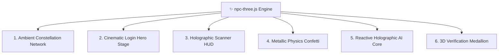

# ✨ Three.js 3D Graphics & Visual FX Engine (`npc-three.js`)

The **NPC 3D Visual Engine** powers the futuristic, high-tech academic atmosphere of Navotas Polytechnic College across portals, login stages, and verification checkpoints.

Connected Nodes:
- Central Brain: [[NPC_ELMS_Brain_Index]]
- UI Design: [[UI_Design_System_and_Tailwind]]
- Student Experience: [[Student_Portal_Architecture]]
- Authentication Stage: [[Authentication_and_Session_State]]

---

## 🌌 1. The 6 Core 3D Subsystems

### 1. Ambient Background Constellation (`initBackground()`)
- Renders an interactive 3D particle and node lattice in fixed coordinates behind dashboard workspaces.
- Mouse movement applies gentle parallax; opacity set to `0.65` with seamless alpha blending so text and data tables remain perfectly legible.
- Auto-mounted across Student, Faculty, and Admin main canvases via `#npc-three-bg-canvas`.

### 2. Cinematic Sign-In Hero (`initLoginHero('login-hero-stage')`)
- Rendered on [login.php](file:///c:/Users/Lovi/Downloads/llama-b10483-bin-win-cpu-x64/LocalAI/app/login.php).
- Features a curved wireframe terrain mesh that undulates like a digital sine wave, coupled with rotating concentric gold orbit rings (`0xfed488`) and glowing blue accent lights.

### 3. Holographic Scanner HUD (`initScannerHUD()`)
- Used on the Attendance QR scanning page ([student/qrcode.php](file:///c:/Users/Lovi/Downloads/llama-b10483-bin-win-cpu-x64/LocalAI/app/student/qrcode.php)).
- Features laser bounding boxes, revolving crosshairs, and dynamic scanning cones.

### 4. 3D Metallic Confetti (`celebrate3D({ count: 160 })`)
- Triggers on successful attendance check-in, capstone submissions, or exam completions.
- Calculates true 3D gravity, drag, and rotation on multi-colored gold, emerald, and azure metallic flakes.

### 5. Reactive Holographic AI Core (`initAiCore()`)
- An undulating, faceted icosahedron that glows and pulses when the AI Assistant is thinking or responding to student queries.

### 6. 3D Verification Medallion (`renderVerificationSeal()`)
- A rotating 3D emerald medallion with an extruded white checkmark, mounted in modal dialogues when official transactions are finalized.

---

## 🌗 2. Dual-Mode Theme Architecture (White Mode & Dark Mode)

The Three.js engine dynamically adapts its shaders, blending mathematics, and color palettes when toggling between **Dark Mode** and **White Mode (Light Mode)**:

| Property | Dark Mode (`html.dark`) | White Mode (`html:not(.dark)`) |
| :--- | :--- | :--- |
| **Material Blending** | `THREE.AdditiveBlending` (glow adds light to navy) | `THREE.NormalBlending` (clean alpha composite over white) |
| **Constellation Nodes** | Azure (`#38bdf8`), Gold (`#fed488`), Cyan (`#a5f3fc`) | Sapphire (`#0284c7`), Amber (`#d97706`), Emerald (`#0f766e`), Royal (`#1d4ed8`) |
| **Connecting Lines** | Fades to Black `(r*α, g*α, b*α)` | Dynamic Lerp to White `r*α + (1-α)` (blends cleanly into white canvas) |
| **Particle Sprites** | Soft glow with warm gold falloff | High-contrast alpha circle preserving rich node pigmentation |
| **Canvas Opacity** | `0.70` | `0.92` (enhanced visibility for subtle paper/desk contrast) |
| **Sign-In Stage Fog** | Navy `#001736` (density `0.0016`) | Daylight Mist `#f8fafd` (density `0.0011`) |

---

## ⚡ 3. Performance & Graceful Degradation
- **Dynamic MutationObserver**: Observes `document.documentElement` for the `.dark` class, instantly hot-swapping vertex buffers and recompiling WebGL materials without destroying instances or dropping frames.
- **WebGL Sniffing**: Inspects `WebGLRenderingContext`. If unavailable or hardware acceleration is disabled, falls back to clean CSS gradients without crashing.
- **`prefers-reduced-motion`**: Respects accessibility preferences by disabling camera orbits and high-frequency animations.
- **Visibility Observer**: Automatically pauses render loops when tabs are inactive to preserve laptop battery and mobile CPU resources.

---
*Backlinks: [[NPC_ELMS_Brain_Index]] | [[UI_Design_System_and_Tailwind]] | [[Authentication_and_Session_State]]*
